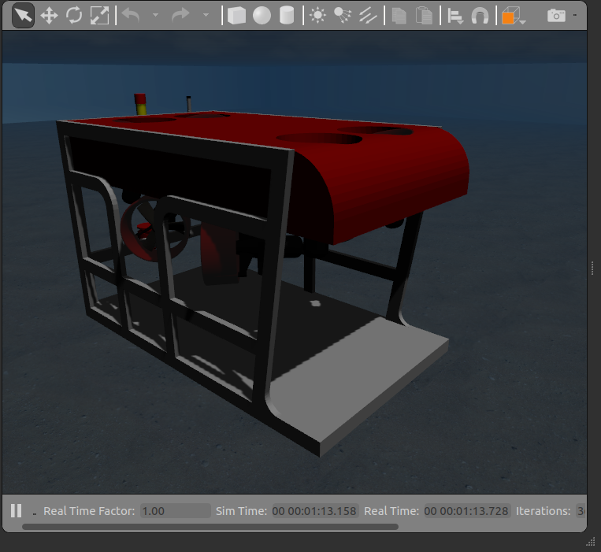

##  UUV Simulator Example Vehicles

### Rexrov

The original example in the UUV Simulator [QuickStart](https://uuvsimulator.github.io/quick_start/)

### Rexrov 2

Note - requires [uuv_simulation_evaluation](https://github.com/uuvsimulator/uuv_simulation_evaluation), but currently having issues building with this package.

Separate package - see [example of usage](https://github.com/uuvsimulator/rexrov2)

### Desistek SAGA ROV

### ECA A9

### Light Autonomous Underwater Vehicle (LAUV)

