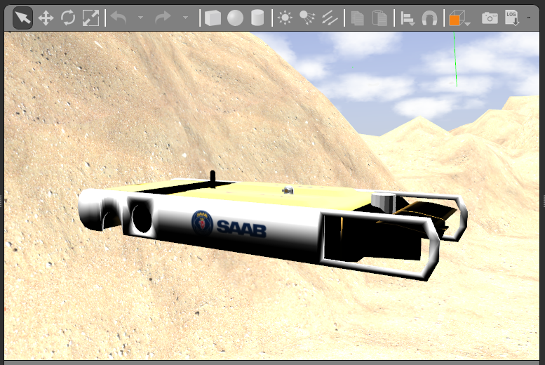
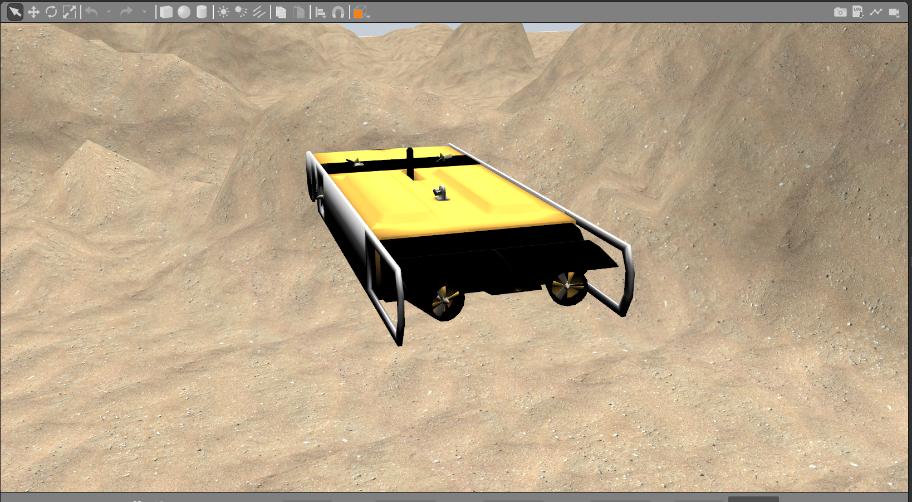
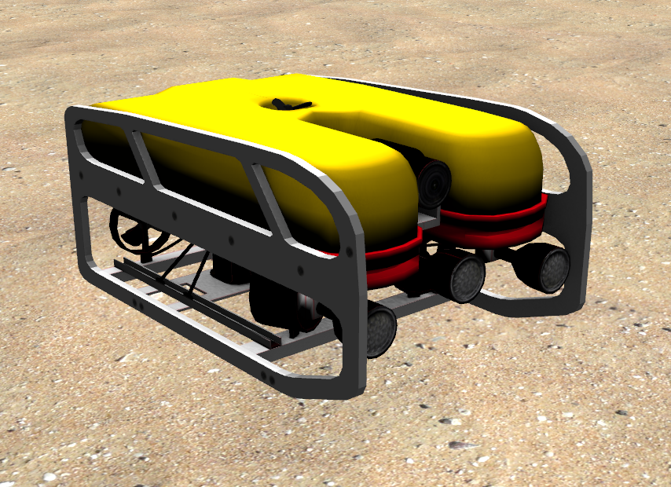
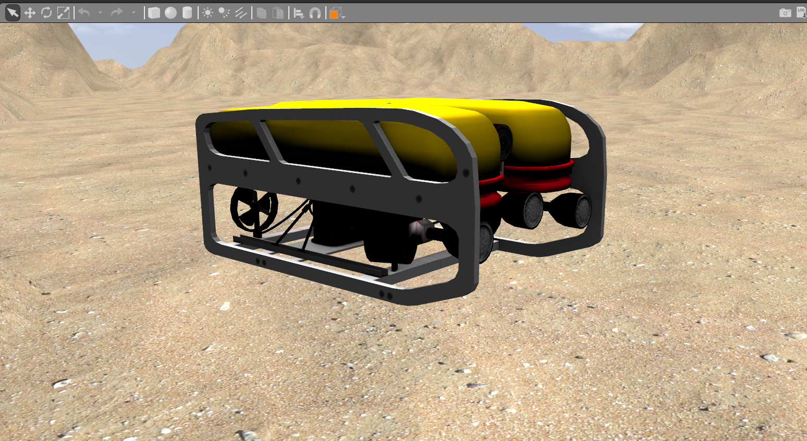
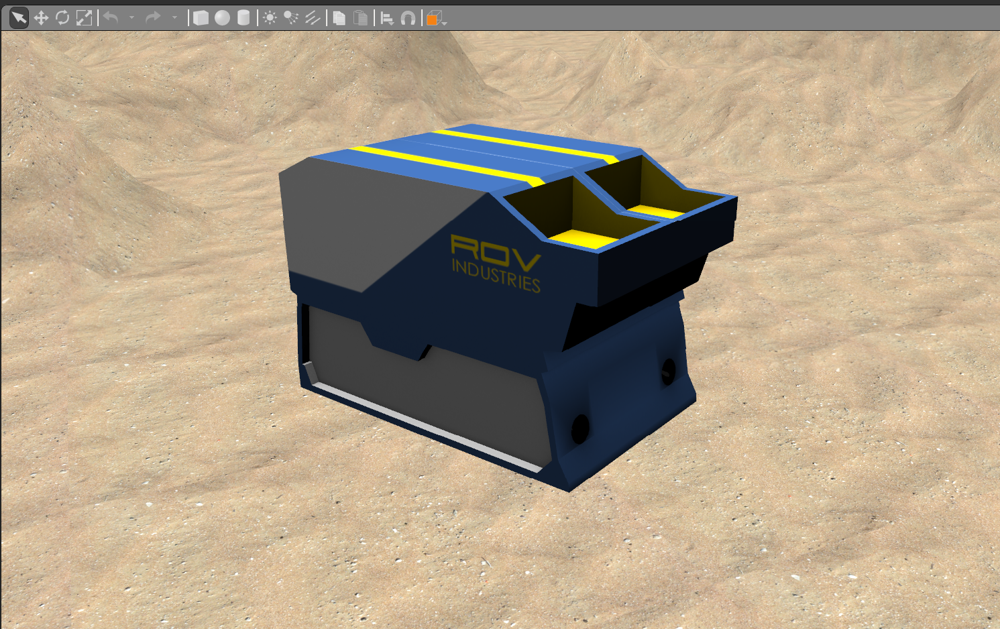

# Examples of Vehicles

Collection of how to spawn existing models.

To spawn a collection of the DAVE models in the same Gazebo world, run

```
roslaunch dave_robot_launch uuv_collection.launch paused:=true
```

which should generate a view like this (sans text labels),


Note that the functionality (closed-loop control, teleoperation, etc.) is not setup in this collective example, but is illustrated for each vessel in the examples below.

## Dave ROVs

### Smilodon

```
roslaunch smilodon_gazebo smilodon.launch
roslaunch uuv_dave joy_thrusterop.launch namespace:=smilodon
```






### Caracara

```
roslaunch caracara_gazebo caracara.launch
roslaunch uuv_dave joy_thrusterop.launch namespace:=caracara
```






### Caldus

```
roslaunch caldus_gazebo caldus.launch
roslaunch uuv_dave joy_thrusterop.launch namespace:=caldus
```




### Virgil
```
roslaunch dave_robot_launch virgil.launch
```
which includes gamepad telop following the convention [Gamepad Teleoperation Mapping](/dave.doc/contents/Logitech-F310-Gamepad-Mapping).


