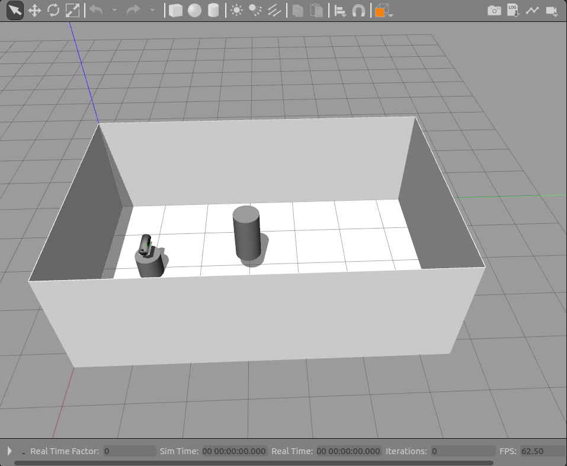
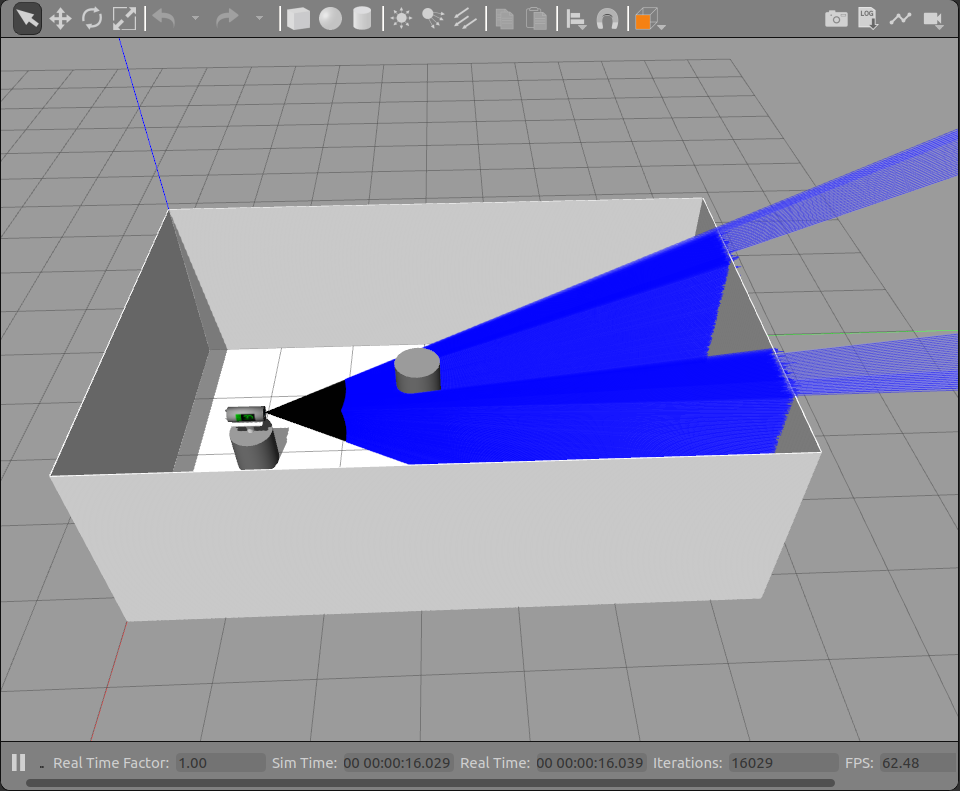
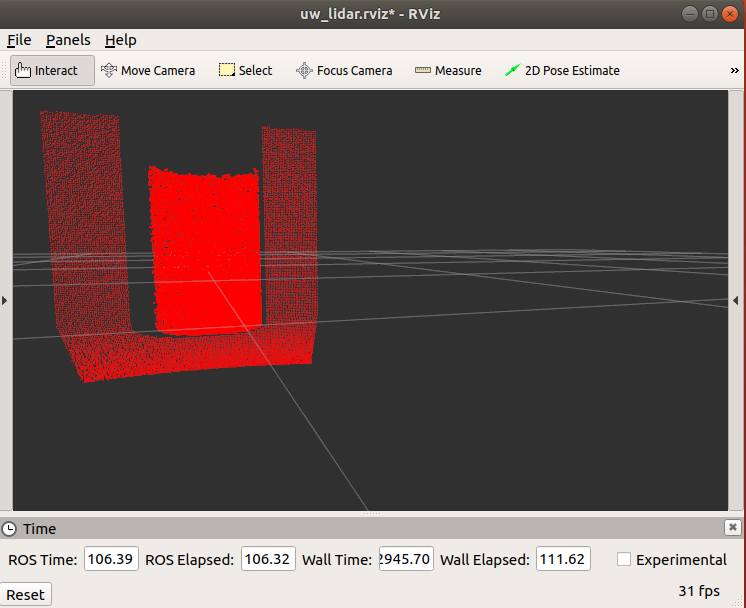

# Overview
This tutorial will launch a basic tank environment with a 3D lidar sensor mounted to a pedestal and a hovering cylindrical target.
* The sensor uses the GPURaySensor, configured to emulate the properties of [3D at Depth's SL3](https://www.3datdepth.com/product/subsea-lidar-sl3) underwater lidar.
* The sensor itself covers a fixed field of view but it attached to a stand that can pan and tilt.

# Prerequisites
This tutorial assumes you have previously installed the DAVE repositories.
* You should be able to run `roslaunch nps_uw_sensors_gazebo uw_lidar_standalone.launch`

# Launch and run the simulation
* To launch the environment, run:
```
roslaunch nps_uw_sensors_gazebo uw_lidar_standalone.launch
```
* If all goes well Gazebo should launch into a simulation environment that looks like this:



* Note that by default, the simulation is paused and no lidar rays are displayed.
* Click the play icon to unpause.
* The lidar rays will display and the sensor will pan to face the target cylinder.
* The end result will look like this:




# Properties
The 3D underwater Lidar sensor has the following properties by default:

* The lidar sensor covers a 30&deg; x 30&deg; sector.
* It uses 145 simulated rays in each horizontal and vertical axis.
* The resolution is set to 0.1 to produce 10 data points per ray, resulting in a point cloud of 1450 x 1450 points.
* The default range is set to a maximum of 20 meters

# ROS topics
The sensor outputs point cloud data to the following ROS topic:
```
/nps_uwl_points
```

The plugin also publishes the following topics which are used to control the sensor stand (see Controlling pan and tilt, below):
```
/nps_uwl/uwl_cmd/pan
/nps_uwl/uwl_cmd/tilt
```

## Visualizing with rviz
A basic rviz configuration for visualizing the plugin point cloud data is saved under `nps_uw_sensors_gazebo/rviz/uw_lidar.rviz`. To bring up rviz with this configuration:
1. Navigate to the root of your catkin workspace. For example:
    ```
    cd ~/uuv_ws/
    ```
1. Launch the simulation in Gazebo:
    ```
    roslaunch nps_uw_sensors_gazebo uw_lidar_standalone.launch
    ```
1. Unpause the simulation to begin generating point cloud data.
1. In a separate terminal, launch RViz using the uw_lidar.rviz configuration file. From the root of your catkin workspace, run:
    ```
    rosrun rviz rviz -d src/nps_uw_sensors_gazebo/rviz/uw_lidar.rviz
    ```
If successful, RViz should launch a separate window that looks something like this:



# Controlling pan and tilt
* The lidar sensor is configured to scan a fixed 30&deg; x 30&deg; 3D field of view.
* The sensor stand is capable of 350&deg; panning motion and 60&deg; tilt, which extends the total reachable view to 360&deg; x 90&deg;.
* The sensor stand position is controlled through the GazeboRosPulseLidar plugin, and can be set in two ways:
    * Statically, using the `uwl_macro` in a `urdf` file. (Useful for simple testing and setting the initial target position).
    * Dynamically, by publishing the desired coordinate to the pan or tilt ros topics. (Useful for controlling the motion of the stand.)

## Setting the initial position from
The initial pan and tilt position for the sensor stand, can be set using the `pan` and `tilt` attributes of the `uwl_macro` defined in `urdf/uw_lidar.xacro`. The values of these arguments will be passed to the `<pan_position>` and `<tilt_position>` elements of the pulse lidar control plugin.

For example, the `uw_lidar_standalone.launch` file used in this demo spawns the `uw_lidar_pedestal_robot`, which contains the following invocation of the `uwl_macro`:
```
<xacro:uwl_macro namespace="uwl" parent_link="robot_base_link" pan="-${pi/2}" tilt="0">
  <origin xyz="0 0 0.25" rpy="0 0 -${pi/2}"/>
</xacro:uwl_macro>
```

The `pan` value causes the stand to swing 90%deg; clockwise at the start of the simulation, and the tilt value indicates that it should remain parallel to the floor.

* Both values are given in radians.
    * The pan range is -35π/36 to 35π/36.
    * The tilt range is -π/6 to π/6.
    * By default, the pan position is set to -π/2, and the tilt is set to 0.
* The pan and tilt positions are controlled by PIDs, so the specified position is treated as a target position.
* The sensor stand will move toward the target position as soon as the simulation begins to run.

## Setting the position dynamically
Once the simulation is running, the target pan and tilt positions of the sensor stand can be updated dynamically by publishing the desired target value to their respective ros topics.

For example, to cause the stand to pan to 60&deg; (π/3), open a new terminal and run:
```
rostopic pub /nps_uwl/uwl_cmd/pan std_msgs/Float32 -- 1.0471975512
```
Similarly, to cause the sensor to tilt up 10&deg; (π/18), run:

```
rostopic pub /nps_uwl/uwl_cmd/tilt std_msgs/Float32 -- 0.17453292519
```

## Launch Mounted to ROV
Run the following to launch a demonstration of the underwater lidar device mounted to a Rexrov vehicle with an Oberon7 arm attached:
```
roslaunch uuv_dave uuv_uwl.launch
```
