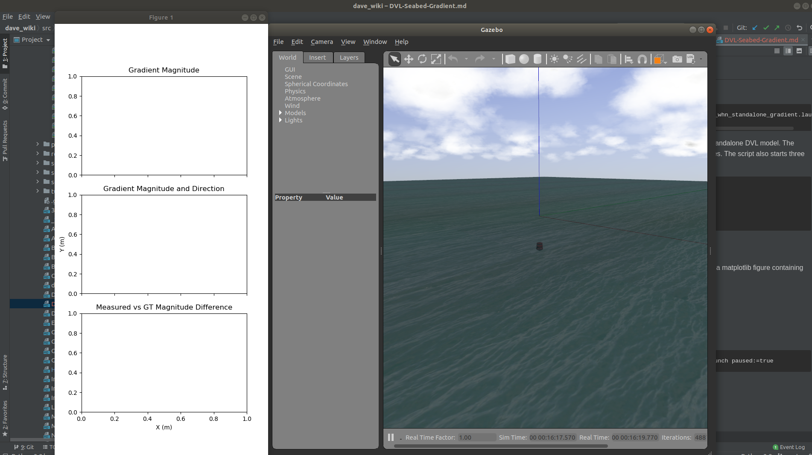

# Visualize Seabed Gradient with DVL

This example demonstrates a simple method for moving a DVL sensor through a scene in Gazebo and generating a gradient map of the seabed. Two examples are available, one using the UUV Simulator DVL, and the other using the Woods Hole Oceanographic Institute's Deep Submergence Lab (DSL) environment DVL.

## Launching Example

The following launch files start the example depending on the DVL. For the
DSL DVL:

```
roslaunch dave_demo_launch dave_dvl_gradient_demo_uuvsim.launch
```
and for the UUV Simulator DVL:

```
roslaunch dave_demo_launch dave_dvl_gradient_demo_dsl.launch
```
Running either launch script starts gazebo and loads a standalone DVL model. The ocean world contains a seabed with known slope values. The script also starts three nodes:

```
/twist_keyboard

/twist_dvl_state

/plot_gradient
```
### Generating the Gradient Map

The launch script should spawn a gazebo window and a figure containing three empty subplots.



In order to build the gradient maps, the sensor must be moved through the
scene. The terminal in which the nodes are launched is running the
`/twist_keyboard` node. The control keys are:

```
Moving around:
    u   i   o
    j   k   l
    m   ,   .

Strafing:
    U   I   O
    J   K   L
    M   <   >

q/z : increase/decrease max speeds by 10%
w/x : increase/decrease only linear speed by 10%
e/c : increase/decrease only angular speed by 10%
```
After moving the sensor around the map for some time, the plots should begin to look like:


The top plot displays the measured gradient magnitude where warmer colors
represent a larger gradient. The central plot shows the magnitude and direction as a quiver plot. The bottom plot shows the difference between the measured and ground truth (GT) gradient magnitude, where warmer colors represent a greater difference between the measured and GT values.

### Implementation Details
On launch, the `teleop_twist_keyboard` node is started and publishes the
`/cmd_vel` twist topic which is used here to send twist messages to the model.

- `dvl_state_and_gradient_(uuvsim/dsl).py`

    This script instantiates a node that subscribes to the following topics with the UUV Simulator DVL:

    ```
    /whn/dvl_sonar0
    /whn/dvl_sonar1
    /whn/dvl_sonar2
    /whn/dvl_sonar3
    /gazebo/model_states
    /cmd_vel
    ```
    and to the following with the DSL DVL:

    ```
    /whn/dvl
    /gazebo/model_states
    /cmd_vel
    ```
    and publishes:
    ```
    /dvl_gradient
    ```
- DSL

    The `/whn/dvl` topic contains a custom DVL message, `ds_sensor_msgs/Dvl`, from which we can extract range values from the individual beams within the `range` list.

- UUV Simulator

    The `/whn/dvl_*` topics contain a `sensor_msgs/Range` message which reports a single range value per beam. The estimated range combined with the sensor layout described in `teledyne_whn_uuvsim_description/urdf/teledyn_whn.xacro` allows for gradient estimation.

    The `/gazebo/model_states` topic is published by gazebo and is required for keeping track of the model location within the world.

    `/gazebo/model_states/` and `/cmd_vel` from `teleop_twist_keyboard` are used to set the twist of the model with the `SetModelState` service.

    `dvl_gradient` contains a `geometry_msgs/Point` message which packages the gradient as `x` and `y` for the 2D direction of increasing gradient in world coordinates and `z` for the magnitude.

- `dvl_gradient_plot.py`

    This script instantiates a node which creates the three realtime plots of the
    gradient measurements. The node subscribes to:

    ```
    /gazebo/model_states
    /dvl_gradient
    ```

    The `scipy.interpolate.griddata` function is used to bin and interpolate the
    data gathered while traversing the world.
