# Introduction
Previous sonar sensor plugins were based on image processing realms by translating each subpixel (point cloud) of the perceived image to resemble sonar sensors with or without sonar equations ([Detailed Review for the previous image-based methods](/dave.doc/contents/image_sonar_description)). Here, we have developed a ray-based multibeam sonar plugin to consider the phase and reberveration physics of the acoustic signals providing raw sonar intensity-range data (the A-plot) using the point scattering model. Physical characteristics, including time and angle ambiguities and speckle noise, are considered. The time and angle ambiguity is a  function of the point spread function of the coherent imaging system (i.e.,  side lobes due to matched filtering and beamforming). Speckle is the granular appearance of an image due to many interfering scatterers that are smaller than the resolution limit of the imaging system.

- Features
   - Physical sonar beam/ray calculation with the point scattering model
     - Generating intensity-range (A-plot) raw sonar data
     - Publishes the data with UW APL's sonar image msg format
   - NVIDIA CUDA core GPU parallelization
     - 10Hz refresh rate with 10m range (Raster version)

- Original Research paper
  - Choi, W., Olson, D., Davis, D., Zhang, M., Racson, A., Bingham, B. S., ... & Herman, J. Physics-based modelling and simulation of Multibeam Echosounder perception for Autonomous Underwater Manipulation. Frontiers in Robotics and AI, 279. [10.3389/frobt.2021.706646](https://www.frontiersin.org/articles/10.3389/frobt.2021.706646)

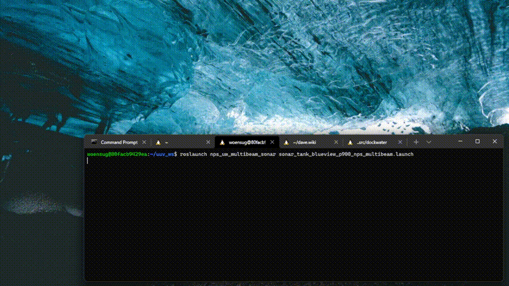

* Note: To obtain sparkling sonar image, `artificialVehicleVibration` tag should be true for raster version. For GPU Ray version, `stddev` or `gaussian_noise_stddev` should be larger than 0.0 (e.g. 0.01)


# Contents
<!-- TOC generated with https://github.com/ekalinin/github-markdown-toc -->
<!--
 cat fls_model_standalone.md | ./gh-md-toc -
-->
- [Introduction](#introduction)
- [Contents](#contents)
- [Background](#background)
  - [Characteristics/fidelity/Features](#characteristicsfidelityfeatures)
    - [Acoustics characteristics based on sonar equation (SNR = SL-2TL-(NL-DI)+TS)](#acoustics-characteristics-based-on-sonar-equation-snr--sl-2tl-nl-dits)
    - [Higher fidelity acoustics characteristics](#higher-fidelity-acoustics-characteristics)
    - [Plugin diagram](#plugin-diagram)
  - [Related works](#related-works)
  - [Approach](#approach)
    - [Single beam sonar model](#single-beam-sonar-model)
    - [Ray based beam sonar model](#ray-based-beam-sonar-model)
    - [Beam pattern](#beam-pattern)
    - [Overall procedures](#overall-procedures)
    - [References](#references)
- [Installation](#installation)
  - [Option A. Use Docker](#option-a-use-docker)
  - [Option B. Install on the Host](#option-b-install-on-the-host)
    - [CUDA Library Installation](#cuda-library-installation)
    - [Clone Repositories](#clone-repositories)
    - [Option A. Using vcs tool](#option-a-using-vcs-tool)
    - [Option B. Git clone manually](#option-b-git-clone-manually)
      - [Multibeam sonar plugin repository](#multibeam-sonar-plugin-repository)
      - [Acoustic message repository](#acoustic-message-repository)
- [Quickstart](#quickstart)
  - [Launch commands](#launch-commands)
    - [Video clip](#video-clip)
  - [Raster vs GPURay](#raster-vs-gpuray)
    - [Sonar image](#sonar-image)
- [Configurations](#configurations)
  - [Gazebo Coordinate Frames](#gazebo-coordinate-frames)
  - [Parameters](#parameters)
    - [Viewport properties](#viewport-properties)
    - [Sonar properties](#sonar-properties)
    - [Plugin properties](#plugin-properties)
  - [Variational Reflectivity](#variational-reflectivity)
    - [Reflectivity by model names](#reflectivity-by-model-names)
      - [How it works](#how-it-works)
      - [Results](#results)
    - [Reflectivity by custom SDF tags](#reflectivity-by-custom-sdf-tags)
      - [Quickstart](#quickstart-1)
      - [How it works](#how-it-works-1)
      - [Results](#results-1)
    - [Output ROS msg](#output-ros-msg)
      - [Rviz Sonar Image Viewer Plugin](#rviz-sonar-image-viewer-plugin)
- [Scenario demonstrations](#scenario-demonstrations)
  - [Local area search scenarios](#local-area-search-scenarios)
    - [GPU Ray vs Raster for local search scenarios](#gpu-ray-vs-raster-for-local-search-scenarios)
    - [Video clip](#video-clip-1)
  - [Degradaded object detection scenarios](#degradaded-object-detection-scenarios)
    - [Examples](#examples)
  - [Terrain Aided Navigation Scenarios](#terrain-aided-navigation-scenarios)
- [Benchmarks](#benchmarks)
  - [Computation time benchmark](#computation-time-benchmark)
- [Acknowledge](#acknowledge)


***

# Background
## Characteristics/fidelity/Features
### Acoustics characteristics based on sonar equation (SNR = SL-2TL-(NL-DI)+TS)
Sonar equations do not consider phase, reverberations between rays
- **Source level (SL)** : predefined by sonar specification
- **Transmission Loss (TL)** : path,  absorption coefficient with ocean (temp, depth)
  Currently, a typical 0.0354 dB/m constant used, with a straight-line path (=distance)
- **Noise Level (NL)** : Ocean dependent, (maybe some statistics models exists). Currently, Gaussian noise is used.
- **Directivity index (DI)** : Sonar transducer specification
  For our purpose, having sonar resolution from the catalogue provides enough information considering typical characteristics of far-field directivity. Currently, half-power width of sinc function is used..
- **Target strength (TS)** : Object material, incident angle dependent. Currently, 1E-4 reflectivity constant used.

### Higher fidelity acoustics characteristics
- **Phase, reverberations (Implemented)**: For high frequency, phase overlaps and reverberations of reflected signals would be crucial, which is the case for the sonars (currently, operation frequency 900 kHz).
- **Transmission paths** : Transmission paths are not straight-line (=distance). The bellhop model can be discussed. This can matter in far-field searching/mission planning.
- **Target strength, Surface/Bottom loss**: Material, incident angle dependent target strength can be used for different objects. Obtaining correct coefficients is complicated, requiring the calculation of reflection/transmission between layers.

### Plugin diagram
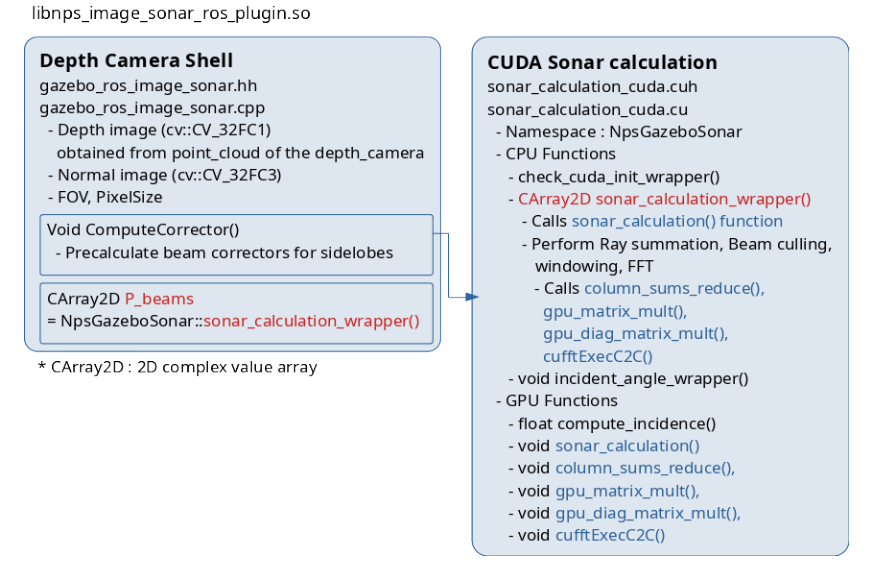

## Related works
Work has been published describing the development of a sonar simulation model. Two of these have developed their models into supporting robotics frameworks.

In [Demarco, 2015](https://ieeexplore.ieee.org/document/7404349), a Gazebo sonar sensor model is developed using ray tracing. The Gazebo ray-tracing functionality generates a 3D point cloud transformed into a sonar image. On inspection, the acoustic properties were either hard-coded or commented out and did not include speckle-noise simulation.

In [Cirqueira, 2017](https://www.sciencedirect.com/science/article/abs/pii/S0097849317301371), a GPU-based sonar simulator is developed using rasterization. The model has two types of sonar: mechanically scanned imaging sonar (MSIS) and FLS. The acoustics features provided in their model are accurate and representative of sound propagation. The sonar sensor model is modelled using a virtual camera and utilizes the following three parameters to render the camera as sonar: pulse distance, echo intensity, and field-of-view. Physical tests were also conducted to compare the simulation results with the physical imaging sonar.

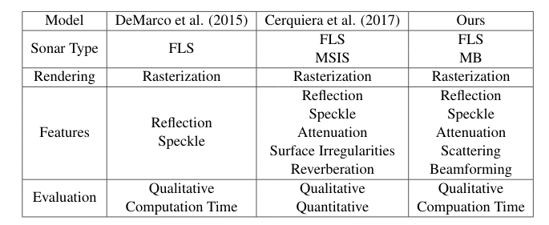

## Approach
The model is based on a ray-based spatial discretization of the model facets, beampattern appropriate for a line array, and a point scattering model of the echo level.

### Single beam sonar model
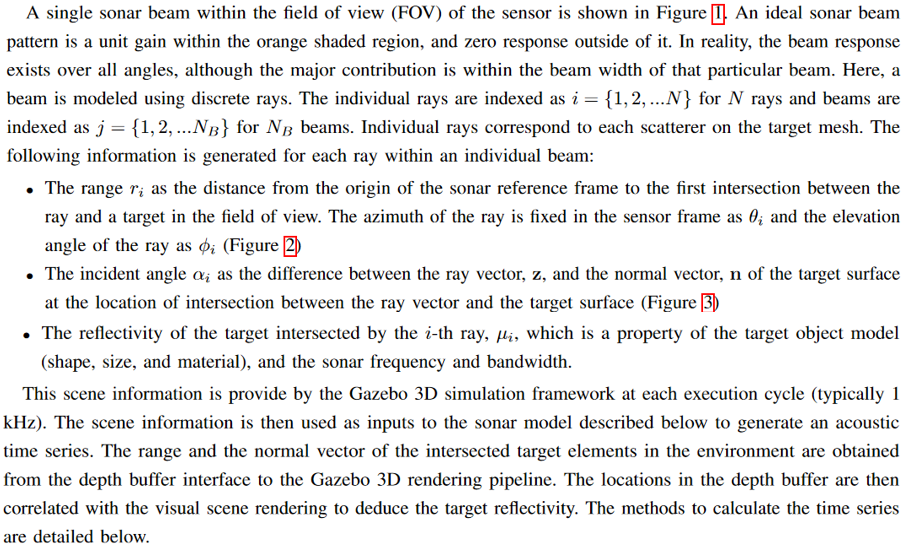
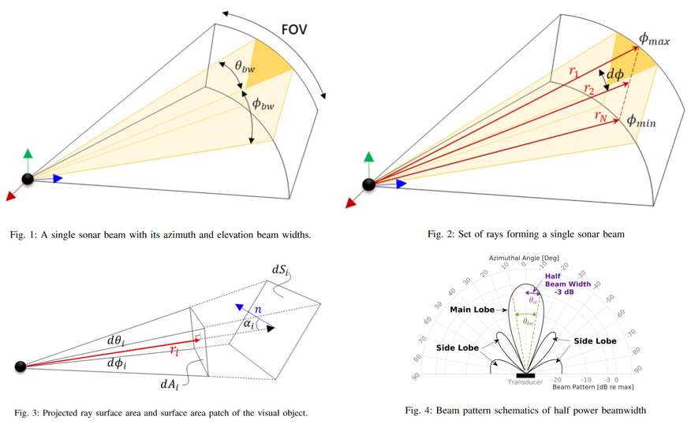
### Ray based beam sonar model
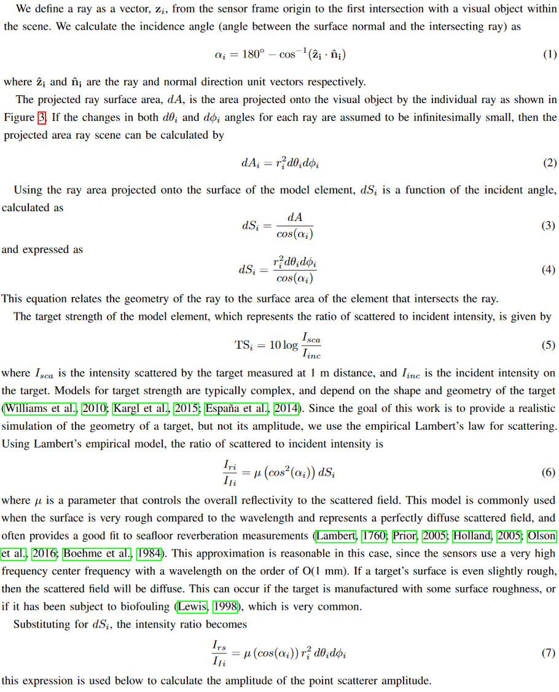
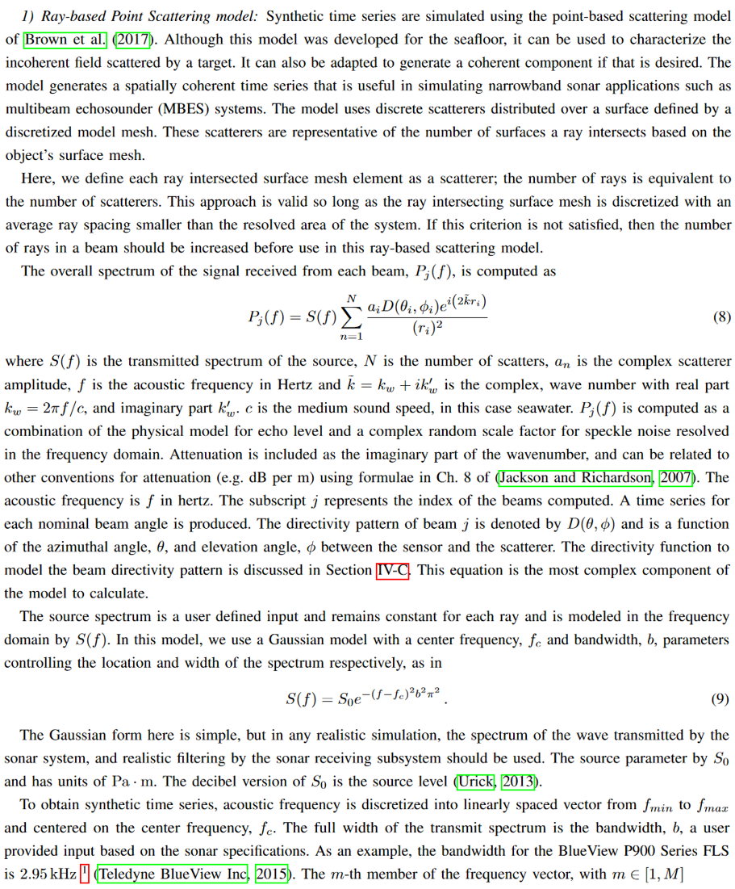
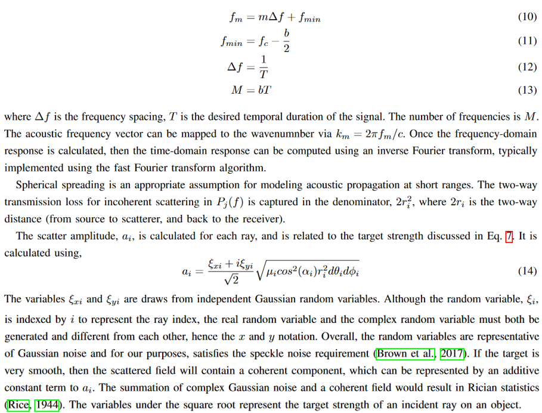
### Beam pattern
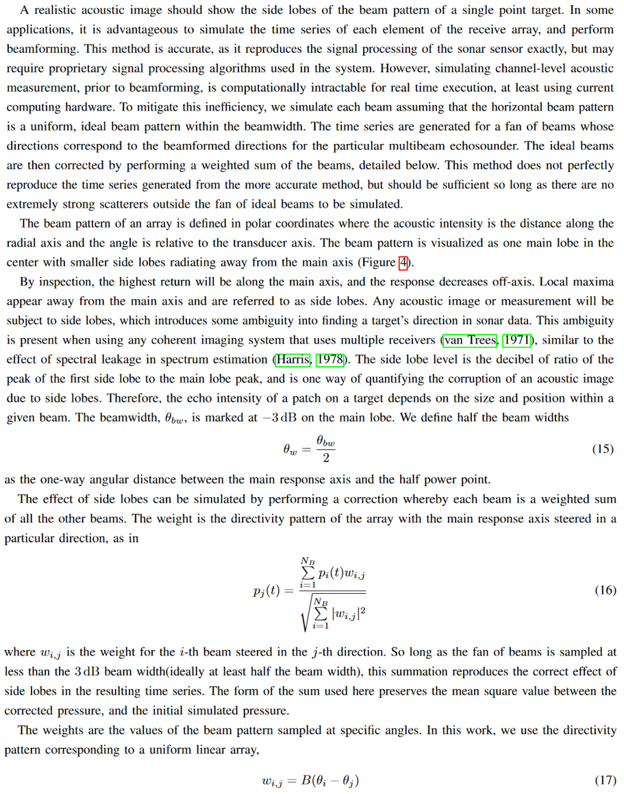
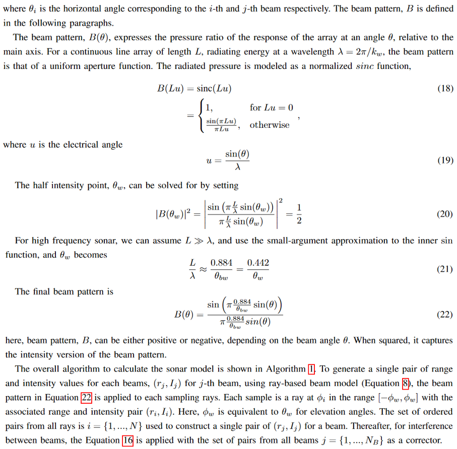
### Overall procedures
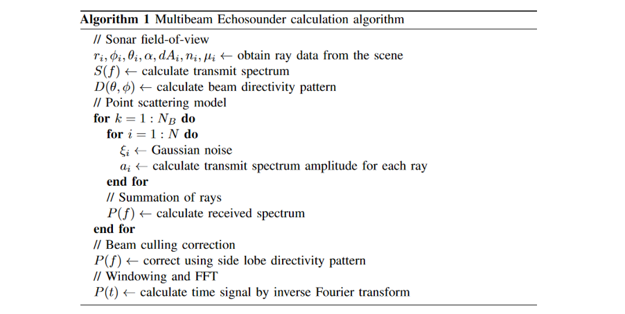
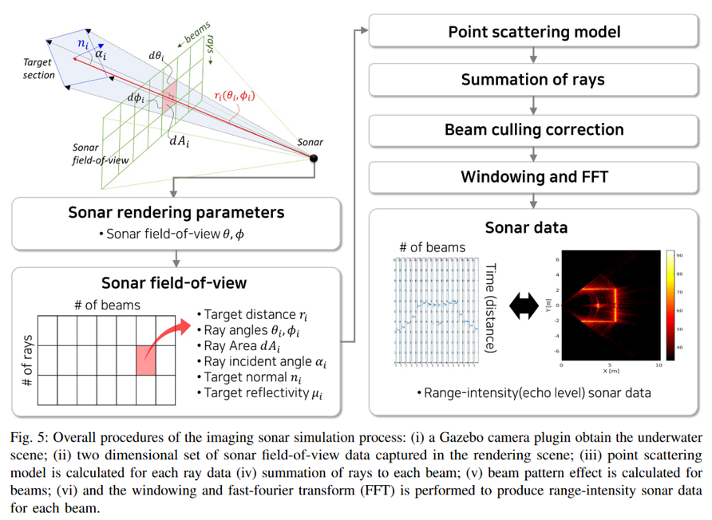
### References
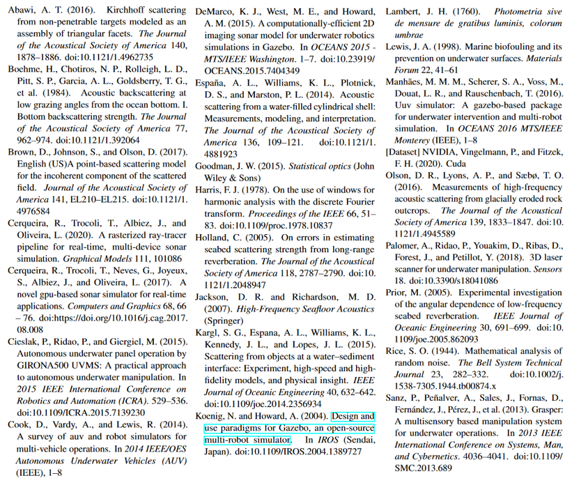

***

# Installation

The CUDA library depend on compatability support of NVIDIA drivers ([CUDA Compatability](https://docs.nvidia.com/deploy/cuda-compatibility/)). Also, old CUDA library versions are not officially supported for lower version of UBUNTU.

Here, I've tested on Ubuntu 22.04, NVIDIA driver 535, CUDA 12.2. The host machine needs to have correct versions installed even using Docker. You can check your NVIDIA driver with `nvidia-smi` and CUDA version with `nvcc --version`.

If you are on 22.04, go with Install on the Host option since the Docker could install other version of NVIDIA driver and CUDA.

## Option A. Install on the Host

### CUDA Library Installation
This plugin demands high computation costs. GPU parallelization is used with the Nvidia CUDA Library. A discrete NVIDIA Graphics card is required.

* The most straightforward way to install CUDA support on Ubuntu 22.04 is:
    * Install NVIDIA driver 545 at `additional drivers` on Ubuntu (Needs restart)
        * Here's [one example with graphical and command-line options](https://linuxhint.com/update-nvidia-drivers-ubuntu-22-04-lts/).
    
    * Install CUDA 12.3
    ```bash
    wget https://developer.download.nvidia.com/compute/cuda/repos/$distro/$arch/cuda-keyring_1.1-1_all.deb
    sudo dpkg -i cuda-keyring_1.1-1_all.deb
    sudo apt update
    # Make sure you are getting 12.3 versions
    sudo apt-get install cuda-toolkit
    ```
    * This installs the Nvidia CUDA toolkit from the Ubuntu repository.

    The final step is to add paths to the Cuda executables and libraries.
    Add these lines to `.bashrc` to include them. You may resource it by `source ~/.bshrc`

    ```bash
    export PATH=/usr/local/cuda/bin${PATH:+:${PATH}}$
    export LD_LIBRARY_PATH=/usr/local/cuda/lib64${LD_LIBRARY_PATH:+:${LD_LIBRARY_PATH}}
    ```

Once you are done, you will see something like the following msg with the `nvidia-smi` command.
```bash
+---------------------------------------------------------------------------------------+
| NVIDIA-SMI 545.23.08              Driver Version: 545.23.08    CUDA Version: 12.3     |
|-----------------------------------------+----------------------+----------------------+
| GPU  Name                 Persistence-M | Bus-Id        Disp.A | Volatile Uncorr. ECC |
| Fan  Temp   Perf          Pwr:Usage/Cap |         Memory-Usage | GPU-Util  Compute M. |
|                                         |                      |               MIG M. |
|=========================================+======================+======================|
|   0  Quadro RTX 3000 with Max...    On  | 00000000:01:00.0 Off |                  N/A |
| N/A   48C    P0              22W /  65W |    606MiB /  6144MiB |      9%      Default |
|                                         |                      |                  N/A |
+-----------------------------------------+----------------------+----------------------+
                                                                                         
+---------------------------------------------------------------------------------------+
| Processes:                                                                            |
|  GPU   GI   CI        PID   Type   Process name                            GPU Memory |
|        ID   ID                                                             Usage      |
|=======================================================================================|
|    0   N/A  N/A      1400      G   /usr/lib/xorg/Xorg                            4MiB |
|    0   N/A  N/A      1993    C+G   ...libexec/gnome-remote-desktop-daemon      596MiB |
+---------------------------------------------------------------------------------------+
```

Also, check cuda version with `nvcc --version`. You would see version 12.3.


***

## Option B. Use Docker
This method assumes that you have followed [Use a Docker Image](/dave.doc/contents/installation/Docker-Development-Image) for system preparation.

Following commands include `-c`, which provides the Cuda library pre-installed.
```bash
# Install virtual environment (venv) for pip
sudo apt-get install python3-venv

# Create a venv
mkdir -p ~/rocker_venv_cuda
python3 -m venv ~/rocker_venv_cuda

# initiate venv
. ~/rocker_venv_cuda/bin/activate

# Install rocker from osrf if not installed
cd ~/rocker_venv_cuda
git clone https://github.com/osrf/rocker.git
cd rocker
python3 -m pip install .

# clone dockwater and change to cuda-dev branch
cd ..
git clone git@github.com:Field-Robotics-Lab/dockwater.git
cd dockwater
git checkout cuda-dev

# Build and run docker image (This may take up to 30 min to finish at the first time)
./build.bash noetic
# the new run.bash command with -c option
./run.bash -c dockwater:noetic
```

When docker environment is ready, clone multibeam forward-looking sonar repo and compile

```bash
# Clone necessary repos for multibeam sonar
cd ~/uuv_ws/src
vcs import --skip-existing --input dave/extras/repos/multibeam_sim.repos .

# Compile and run tutorial case
cd ~/uuv_ws
catkin build
source ~/uuv_ws/devel/setup.bash
roslaunch nps_uw_multibeam_sonar sonar_tank_blueview_p900_nps_multibeam.launch
```

```
# To open another terminal inside docker container,
# At new terminal window
. ~/rocker_venv_cuda/bin/activate
cd ~/rocker_venv_cuda/dockwater
./join.bash dockwater_noetic_runtime
cd ~/uuv_ws
source devel/setup.bash
```

### Clone Repositories

### Option A. Using vcs tool
```
cd ~/uuv_ws/src
vcs import --skip-existing --input dave/extras/repos/multibeam_sim.repos .
```
vcs will use `multibeam_sim.repos` file inthe dave repository that includes both `nps_uw_multibeam_sonar` and `marine_msgs`.

### Option B. Git clone manually
#### Multibeam sonar plugin repository
The multibeam sonar sensor plugin is at [nps_uw_multibeam_sonar repository](https://github.com/Field-Robotics-Lab/nps_uw_multibeam_sonar)
Make sure to include the repository on the workspace before compiling.
```
git clone https://github.com/Field-Robotics-Lab/nps_uw_multibeam_sonar.git
```

#### Acoustic message repository
Final results are exported as a [ProjectedSonarImage.msg](https://github.com/apl-ocean-engineering/marine_msgs/blob/main/marine_acoustic_msgs/msg/ProjectedSonarImage.msg) of UW APL's sonar image msg format. Make sure to include the repository on the workspace before compiling.
```
git clone https://github.com/apl-ocean-engineering/marine_msgs.git
```


# Quickstart

## Launch commands
The repository includes four sonar models (Blueview P900, Blueview M450, Seabat F50, and Oculus M1200d)
```bash
# Raster version
roslaunch nps_uw_multibeam_sonar sonar_tank_blueview_p900_nps_multibeam.launch
roslaunch nps_uw_multibeam_sonar sonar_tank_blueview_m450_nps_multibeam.launch
roslaunch nps_uw_multibeam_sonar sonar_tank_seabat_f50_nps_multibeam.launch
roslaunch nps_uw_multibeam_sonar sonar_tank_oculus_m1200d_nps_multibeam.launch
# GPU Ray version
roslaunch nps_uw_multibeam_sonar sonar_tank_blueview_p900_nps_multibeam_ray.launch
# URDF description version (gpu_ray true/false to change between Raster and GPU ray versions)
roslaunch nps_uw_multibeam_sonar sonar_tank_blueview_p900_nps_multibeam_urdf.launch
```

If you see some errors after CUDA and NVIDIA driver installation, try running `catkin_make` several times.

When closing the simulation with the `ctrl+c` command, it often hangs waiting for the Gazebo window to terminate. You can force close it using the `pkill gzclient && pkill gzserver` command at another terminal window.

### Video clip
- [youtube link](https://www.youtube.com/watch?v=2Xhzf8MCAUI)


* Note: To obtain sparkling sonar image, `artificialVehicleVibration` tag should be true for raster version. For GPU Ray version, `stddev` or `gaussian_noise_stddev` should be larger than 0.0 (e.g. 0.01)

## Raster vs GPURay
There are two types of multibeam sonar plugin in the repository. Raster version and GPURay version. They output identical results but GPURay version has a freedom to use more number of rays in cost of calculation time and variational reflectivty feature.

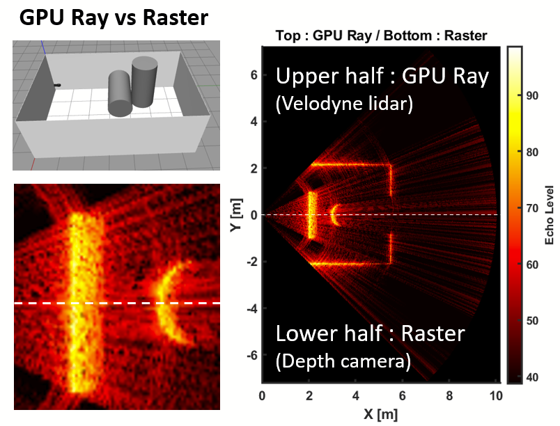

- Raster version
  - It is based on the `depth camera` sensor to obtain point cloud dataset for sonar signal calculations
  - It's usually faster than GPURay version but unable to define number of vertical rays. Also, variational reflecitivty according to model names are applicable.
- GPURay version
  - It is based on the `GPU Ray` sensor packaged for [Velodyne Simulator](https://github.com/lmark1/velodyne_simulator) to obtain point cloud dataset for sonar singnal calculations
  - It's usually slower than Raster version but it can define the number of vertical rays with `fidelity` parameter. It can only be used with constant reflectivity value for all models.

### Sonar image
- Live view capture plotted using `image_view` defined at the launch file.
  - Right-clicking it will save the image at `/tmp` directory
  - If you want to resize on the fly, change `autosize` tag to `false` at the launch file.

- Exported data visualized with the MATLAB script at `scripts/plotRawData.m`


# Configurations

## Gazebo Coordinate Frames

The plugin outputs sonar data using the [marine_acoustic_msgs/ProjectedSonarImage](https://github.com/apl-ocean-engineering/marine_msgs/blob/main/marine_acoustic_msgs/msg/ProjectedSonarImage.msg) ROS message.  This message defines the bearing of each sonar beam as a rotation around a **downward-pointing** axis, such that negative bearings are to port of forward and positive to starboard (if the sonar is installed in it"s "typical" forward-looking orientation).

The plugin will use the Gazebo frame name as the `frame_id` in the ROS message. For the sonar data to re-project correctly into 3D space, it **must** be attached to an X-Forward, Y-Starboard, Z-Down frame in Gazebo.

## Parameters
Parameters for the sonar is configured at each `model.sdf` or `urdf/multibeam_sonar_blueview_p900.xacro` file

### Viewport properties

- Raster version

    Viewport of the sonar is defined using depth camera parameters configuration including FOV, Clip(Range), nBeams, nRays
    - Field of view (FOV)
    ```xml
    <!-- 90 degrees for the M900-90 -->
    <horizontal_fov>1.57079632679</horizontal_fov>
    ```
    - Range (clip)
    ```xml
    <clip>
      <near>02</near> <!-- optimal 2m-60m -->
      <far>60</far>
    </clip>
    ```
    - nBeams (width), nRays (height, also act as vertical field of view)
    ```xml
    <image>
      <width>512</width>
      <!-- Set vertical FOV by setting image height -->
      <!-- Approx 2 times the spec sheet (sepc: 20 deg.) -->
      <height>224</height>
    </image>
    ```
      - Here, the `<height>` is set to define as if 40 deg, which is approximately two times that of the spec sheet. The correct vertical FOV is defined at `<verticalFOV>` below.

- GPU Ray version

    Viewport of the sonar is defined using gpu_ray type sensor configurations including horizontal and vertical field of view and sampling numbers

    ```xml
    <ray>
      <scan>
        <!-- Set horizontal FOV by setting image height -->
        <!-- 512 beams with 90 degrees horizontal FOV (M900-90) -->
        <horizontal>
          <samples>512</samples>
          <resolution>1</resolution>
          <min_angle>-0.78539816339</min_angle>
          <max_angle>0.78539816339</max_angle>
        </horizontal>
        <!-- Set vertical FOV by setting image height -->
        <!-- Approx 2 times the spec sheet (sepc: 20 deg.) -->
        <vertical>
          <samples>300</samples>
          <resolution>1</resolution>
          <min_angle>-0.349066</min_angle>
          <max_angle>0.349066</max_angle>
        </vertical>
      </scan>
      <range>
        <!-- min range is a collision range no need to change-->
        <min>0.1</min>
        <max>10.0</max>
        <resolution>0.1</resolution>
      </range>
      <noise>
        <type>gaussian</type>
        <!-- Noise parameters based on published spec for Hokuyo laser
            achieving "+-30mm" accuracy at range < 10m.  A mean of 0.0m and
            stddev of 0.01m will put 99.7% of samples within 0.03m of the true
            reading. -->
        <mean>0.0</mean>
        <stddev>0.01</stddev>
      </noise>
    </ray>
    ```

    Here, the `<vertical> -> <samples>` parameter represents the number of rays in each beams (typically vertical direction). In xacro, it can be defined using the `fidelity` parameter.


### Sonar properties
Parameters for sonar calculation are defined also at the `model.sdf` or `urdf/multibeam_sonar_blueview_p900.xacro` file including Sonar Freq, Bandwidth, Soundspeed, Source Level.
```xml
<verticalFOV>20</verticalFOV>
<sonarFreq>900e3</sonarFreq>
<bandwidth>29.9e3</bandwidth>
<soundSpeed>1500</soundSpeed>
<sourceLevel>220</sourceLevel>
<maxDistance>10</maxDistance>
```

### Plugin properties
Calculation settings including Ray skips, Max distance, writeLog/interval, DebugFlag, Publishing topic names can be changed.
- `maxDistance`: Defines max distance of the targets, which also defines the length of the signal for each beam. Ideally, it should match the `clip` parameter of the depth camera properties.
- `ray skips`: Used to reduce calculation time to jump rays to calculate. Each beam's total number of rays is defined at the `height` parameter of the depth camera properties.
- `sensor gain`: Used to specify sensor gain for better visualization.
`plot scaler`: Used to scale the value on the bundled viewer window, which is plotted with ROS's `rqt_image_view` package.
- `writeLog` Flag : if on, raw data is saved as `csv` file at `/tmp/` with the rate of `writeFrameInterval` as `SonarRawData_000001.csv`. Also, for the GPU Ray version, `SonarRawData_beam_angles.csv` is saved.
   - Extracting CSV files out of docker container
     - Use following `docker cp` command at another terminal window

       ```bash
       docker cp dockwater_noetic_runtime:/tmp/SonarRawData_000001.csv .
       docker cp dockwater_noetic_runtime:/tmp/SonarRawData_beam_angles.csv .
       ```

   - Plotting scripts
     - You may use the [`scripts/plotRawData_Raster_based.m` (for Raster version)](https://github.com/Field-Robotics-Lab/nps_uw_multibeam_sonar/blob/main/scripts/plotRawData_Raster_based.m) and [`scripts/plotRawData_GPURay_based.m` (for GPU ray version)](https://github.com/Field-Robotics-Lab/nps_uw_multibeam_sonar/blob/main/scripts/plotRawData_GPURay_based.m)to plot the figures using MATLAB.
- `debugFlag` Flag : if on, the calculation time for each frame is printed at the console.
- `artificialVehicleVibration` Flag : if on, the gaussian noise values will change constantly as sparkling sonar image in the example gif on this wiki. The sparkling noise (continuous change of random noise values even when the sonar scene is static) does not occur in the real world unless the vehicle the sonar is attached is moved or the object in the scene is changed. These physical characteristics are exploited in some scenarios to recognize the changes in the scene by detecting those noise changes. In the plugin, the Gaussian noise value (the random noise value) is changed whenever the maximum distance of the objects in the scene is changed. This flag parameter changes the random values on every frame to imitate as if the vehicle is vibrating in position.

```xml
<maxDistance>10</maxDistance>
<raySkips>10</raySkips>
<sensorGain>0.02</sensorGain>
<plotScaler>1</plotScaler>
<writeLog>false</writeLog>
<debugFlag>false</debugFlag>
<writeFrameInterval>5</writeFrameInterval>
<artificialVehicleVibration>false</artificialVehicleVibration>
<!-- This name is prepended to ROS topics -->
<cameraName>blueview_p900</cameraName>
```

- ROS Topic names
You can also define topic names for sonar image and other data.

   - Raster version

      ```xml
      <!-- ROS publication topics -->
      <imageTopicName>image_raw</imageTopicName>
      <cameraInfoTopicName>image_raw/camera_info</cameraInfoTopicName>
      <pointCloudTopicName>point_cloud</pointCloudTopicName>
      <depthImageTopicName>image_depth</depthImageTopicName>
      <depthImageCameraInfoTopicName>image_depth/camera_info</depthImageCameraInfoTopicName>
      <sonarImageRawTopicName>sonar_image_raw</sonarImageRawTopicName>
      <sonarImageTopicName>sonar_image</sonarImageTopicName>
      <frameName>forward_sonar_optical_link</frameName>
      ```

   - GPU Ray version

      ```xml
      <!-- ROS publication topics -->
      <imageTopicName>image_raw</imageTopicName>
      <cameraInfoTopicName>image_raw/camera_info</cameraInfoTopicName>
      <pointCloudTopicName>multibeam_sonar_point_cloud</pointCloudTopicName>
      <depthImageTopicName>image_depth</depthImageTopicName>
      <depthImageCameraInfoTopicName>image_depth/camera_info</depthImageCameraInfoTopicName>
      <sonarImageRawTopicName>sonar_image_raw</sonarImageRawTopicName>
      <sonarImageTopicName>sonar_image</sonarImageTopicName>
      <frameName>forward_sonar_optical_link</frameName>
      ```

      For, GPU Ray version, the `pointCloudTopicName` must match with the `topicName` of velodyne_gpu_laser plugin. In xacro, the point cloud topic name from velodyne_gpu_laser is prefixed with the namespace of the parent robot. Therefore, the topic `pointCloudTopicName` should include the prefix too.

      ```xml
      <plugin name="ray_sonar_sensor" filename="libgazebo_ros_velodyne_gpu_laser.so">
          <topicName>multibeam_sonar_point_cloud</topicName>
          <static_reference_frame>forward_sonar_optical_link</static_reference_frame>
          <organize_cloud>true</organize_cloud>
          <min_range>0.2</min_range>
          <max_range>10.0</max_range>
      </plugin>
      ```


## Variational Reflectivity
Although high fidelity target strength is beyond reach for simple implementation, users can give different surface reflectivity on the scene's objects.

* Note
  - Variational reflectivity can slow down the refresh rate significantly.
  - The plugin will initiate with constant reflectivity and may take some seconds to refresh the image with variational reflectivities.

### Reflectivity by model names
#### How it works
  - The parameter to switch the feature is defined at `model.sdf` of the sonar model (in this case, `nps_uw_multibeam_sonar/models/blueview_p900_nps_multibeam/model.sdf`. Assining the `<constantReflectivity>` and `<customSDFTagReflectivity>` as false will turn the variational reflectivity by the model name feature on.

     ```xml
      <constantReflectivity>false</constantReflectivity>
      <customSDFTagReflectivity>false</customSDFTagReflectivity>
      <!-- The CSV databsefile is located at the worlds folder -->
      <reflectivityDatabaseFile>variationalReflectivityDatabase.csv</reflectivityDatabaseFile>
     ```

  - Values are defined for each model object in the world. The values are defined using the CSV file in the worlds folder. The default value is 0.001. The example CSV file is at /worlds/variationalReflectivityDatabase.csv

     ```
      basement_tank_model,0.0001
      cylinder_target1,0.005
      cylinder_target2,0.001
     ```

  - `cv::Mat this->reflectivityImage` is calculated if the scene is changed (it detects the change by comparing the maximum depth value of the depth camera with the previous scene. If the value is stabled (if equal for three consecutive frames, the calculation is performed once)
  - The `reflectivityImage` OpenCV matrix is then transferred to GPU memory and used for sonar calculation

#### Results

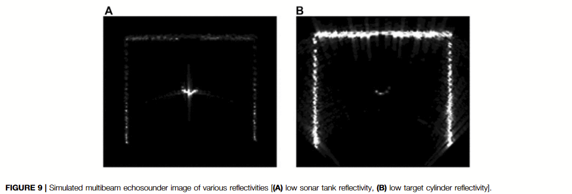


### Reflectivity by custom SDF tags
#### Quickstart
```
roslaunch nps_uw_multibeam_sonar sonar_tank_oculus_m1200d_nps_multibeam_customSDFTag.launch
```
#### How it works
  - The parameter to switch the feature is defined at `model.sdf` of the sonar model (in this case, `nps_uw_multibeam_sonar/models/blueview_p900_nps_multibeam/model.sdf`. Assining the `<constantReflectivity>` as false and `<customSDFTagReflectivity>` as true will turn the variational reflectivity by the custom Tag feature on.
  - Example tag names and how they are defined
    - ```xml
      <!-- Custom SDF elements for surface properties -->
      <surface_props:material>metal</surface_props:material>
      <surface_props:biofouling_rating>10</surface_props:biofouling_rating>
      <surface_props:roughness>0.1</surface_props:roughness>
      ```
  - You can add as many tags as you want. How they contribute to the final reflectivity is defined at the CSV file (/worlds/customSDFTagDatabase.csv)
    - ```
      biofouling_rating,20.0
      roughness,5.0
      default,0.001
      metal,0.005
      rubber,0.0001
      ```
    - the material name (default, metal, and rubber) defines the base reflectivity values. The biofouling_rating, roughness, and any other tags you want to add will affect the reflectivity value as coefficients to change the base value.

#### Results

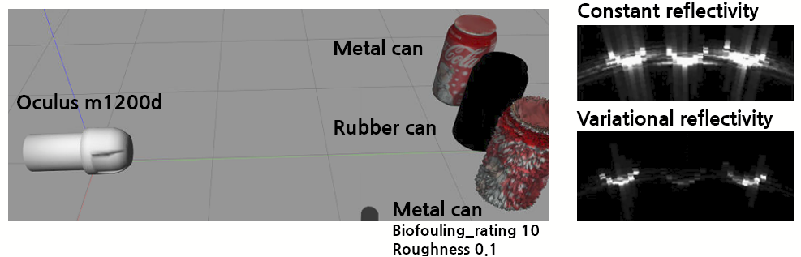


### Output ROS msg
The final output of the sonar image is sent in two types.
- Topic name `sonar_image`
  - This is a msg used internally to plot using with `image_view` package of ROS.
  - The data is generated using OpenCV's `CV_8UC1` format, normalized with `cv::NORM_MINMAX`, colorized with `cv::COLORMAP_HOT`, and changed into msg format using `BGR8` format
- Topic name `sonar_image_raw`
  - This is a msg matched with [UW APL's ProjectedSonarImage.msg](https://github.com/apl-ocean-engineering/marine_msgs/blob/main/marine_acoustic_msgs/msg/ProjectedSonarImage.msg#L5).
  - The data is in `uint8`.

#### Rviz Sonar Image Viewer Plugin
There is a dedicated sonar image viewer rviz plugin developed by Roland Arsenault.
To use this, include rviz_sonar_image repository in the `src` directory and compile them.

```bash
# clone and compile rviz_sonar_image repo
cd ~/uuv_ws/src/
git clone https://github.com/rolker/rviz_sonar_image
cd ../
catkin build rviz_sonar_image

# run rviz after running the launch file
rviz
```

At rviz, add `ProjectedSonarImageDisplay` and select `sonar_image_raw` topic of the sonar being published.

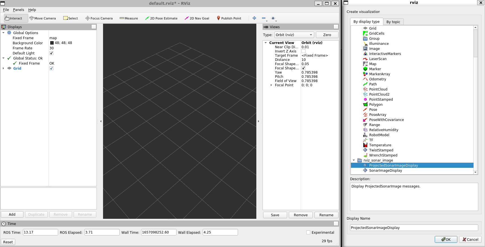
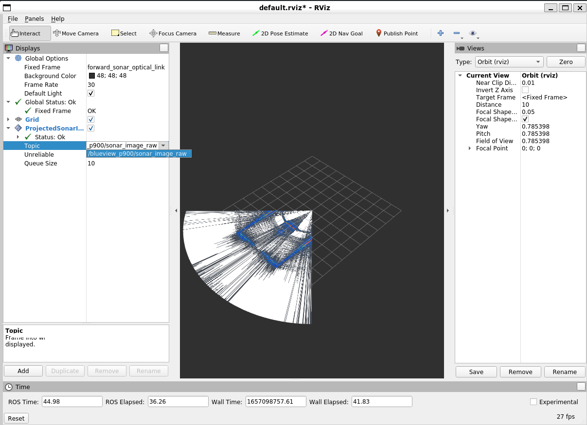


# Scenario demonstrations

## Local area search scenarios

GPU Ray version of the multibeam sonar can fully support local seach scenarios where the sonar is pitched down toward the seafloor. Using the example models in Dave, the world/launch files are included for user demonstrations.

### GPU Ray vs Raster for local search scenarios

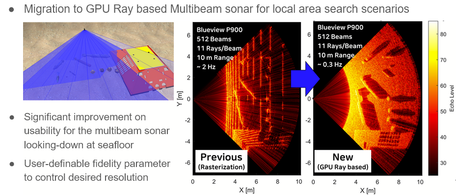

- Raster version

   ```
    # generic sdf; not urdf
    roslaunch nps_uw_multibeam_sonar local_search_blueview_p900_nps_multibeam_raster.launch
    # urdf standalone
    roslaunch nps_uw_multibeam_sonar local_search_blueview_p900_nps_multibeam_urdf_standalone_raster.launch
   ```

   - Insufficient elevation rays when sonar view angle is grazing the seafloor
      - Raster (Depth-camera) based sonar plugin cannot change the number of elevation rays (Fixed with the definition of horizontal/vertical FOVs)
   - 512 Horizontal Beams (Each Beam has 228 elevation rays)

- Ray version

   ```
    # generic sdf; not urdf
    roslaunch nps_uw_multibeam_sonar local_search_blueview_p900_nps_multibeam_ray.launch
    # urdf standalone
    roslaunch nps_uw_multibeam_sonar local_search_blueview_p900_nps_multibeam_urdf_standalone_ray.launch
   ```

   - Number of elevation rays is user-definable, of course, with the cost of calculation time
   - 512 Horizontal Beams (Each Beam has 500 elevation rays)

### Video clip
- [youtube link](https://www.youtube.com/watch?v=SGdDNWwfcJg )

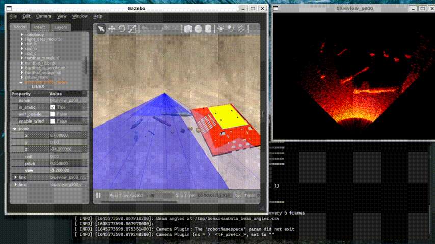


## Degradaded object detection scenarios

Multibeam sonar can be used for detection of degradation in the objects. To realize this scenarios, you may distort the model using the [mesh_destortion](https://github.com/Field-Robotics-Lab/dave/tree/master/urdf/scripts/mesh_distortion) script that automatically distort the mesh models.

### Examples

- Large model example : Ship reck (original vs distorted)

    ```bash
    roslaunch nps_uw_multibeam_sonar sonar_shipwreck_blueview_p900_nps_multibeam.launch
    ```

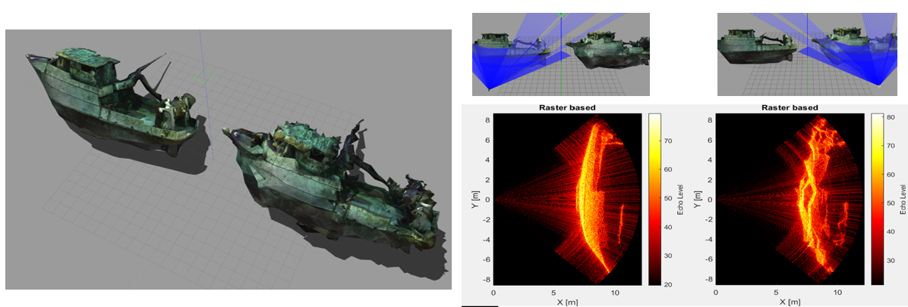


- Small model example : Vase (original vs distorted)

    ```bash
    roslaunch nps_uw_multibeam_sonar sonar_vase_blueview_p900_nps_multibeam.launch
    ```

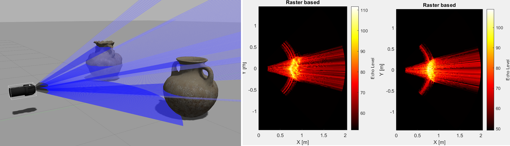


## Terrain Aided Navigation Scenarios

- [TAN Development support features](/dave.doc/contents/Terrain-Aided-Navigation-(TAN)-Senarios)


# Benchmarks
## Computation time benchmark
-  at workstation (i9-9900K 3.6GHz, Nvidia GeForce RTX 2080Ti)
- 10 Hz achievable with Ray and Range reduced

|   512 Beams  |  Refresh  <br>  Rate [Hz]    | Total  <br>  Time [s]|  Core | Sum | Corr | FFT  |
|-------------------|--------------|-----------|------------|-----|-----|-----|
| **Full Calculation** <br> 60 m Range <br> 114 Rays      | **0.5 Hz** | 1.7 s | 0.3 | 1.26 | 0.05 | 0.03 |
| **Ray Reduced**  <br> 60 m Range <br> 11 Rays          | **3.0 Hz** | 0.27 s | 0.02 | 0.16 | 0.05 | 0.03 |
| **Ray/Range Reduced**  <br> 10 m Range <br> 11 Rays | **10 Hz** | 0.06 s | 0.00 | 0.04 | 0.01 | 0.00 |


# Acknowledge
- Woensug Choi
- Brian Bingham
- Duane Davis
- Derek Olsen
- Bruce Allen
- Carson Vogt
- Laura Lindzey
- Mabel Zhang
