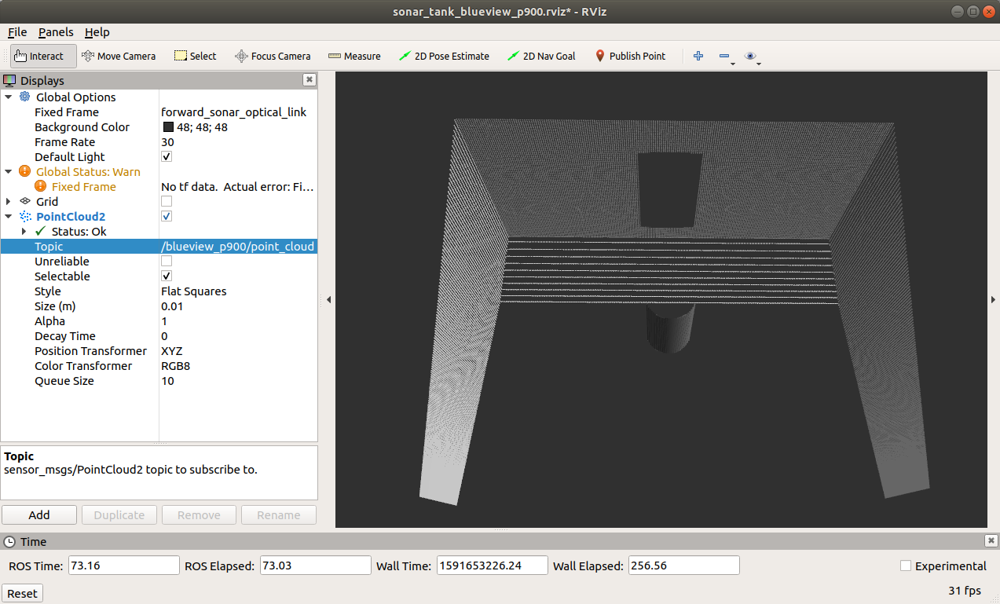
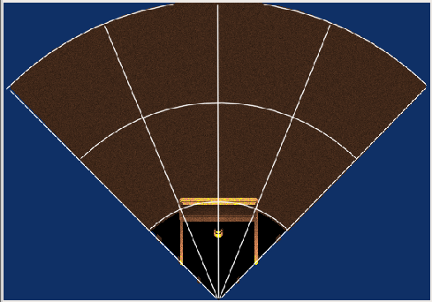
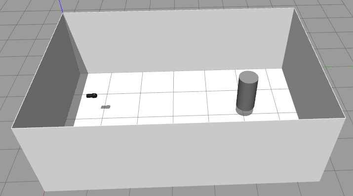
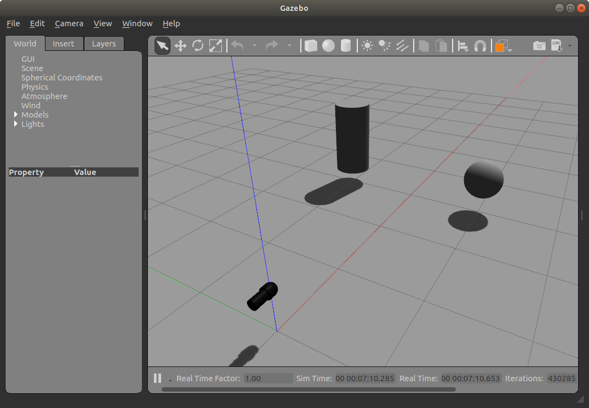
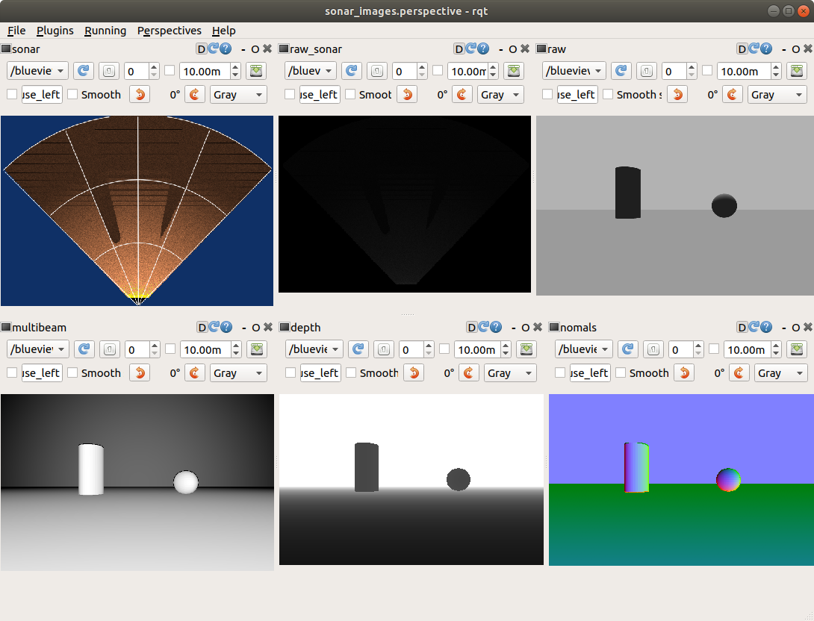
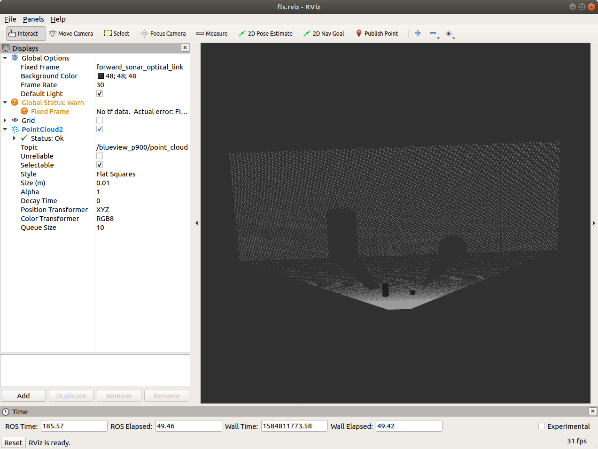
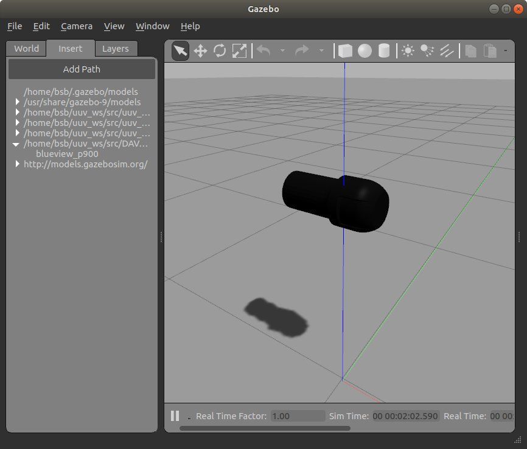
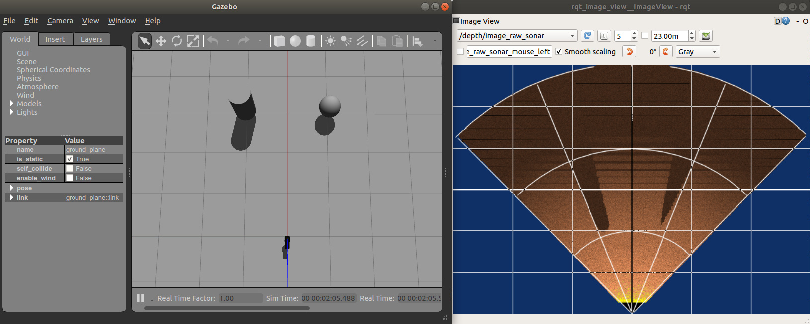
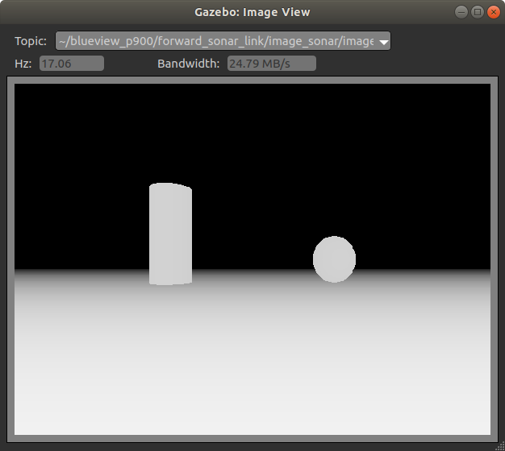

# Contents

<!-- TOC generated with https://github.com/ekalinin/github-markdown-toc -->
<!--
 cat fls_model_standalone.md | ./gh-md-toc -
-->


* [Visual Models](#visual-models)
* [Tutorial: Creating FLS Standalone Example](#tutorial-creating-fls-standalone-example)
  * [Quickstart](#quickstart)
  * [Creating a ROS package and a new model](#creating-a-ros-package-and-a-new-model)
  * [Create a world file with the new model already in place](#create-a-world-file-with-the-new-model-already-in-place)
  * [Adding and configuring the plugin](#adding-and-configuring-the-plugin)
  * [Add viewer / visualization](#add-viewer--visualization)

# Foward Looking Sonar

Demonstration and tutorial for forward looking sonar (FLS) examples to illustrate using visual models (meshes and textures) along with configuring the UUV Simulator image sonar plugin (see [Image Sonar Notes and Description](/dave.doc/contents/image_sonar_description)).

## Visual Models
Three FLS models are available.  Each runs stand-alone in a tank.  Here are the views and point clouds for each:

### BlueView P900

The physical BlueView P900-90 operates at 900 kHz.  The sensor characteristics are as follows
  * (Horizontal) field-of-view, 90 degrees.
  * Beam width, 90 x 1 degrees
  * Number of beams, 512
  * Beam spacing 0.18 degrees
  * Range resolution 2.45 cm

The parameters of the [UUV Simulator image sonar plugin](/dave.doc/contents/image_sonar_description) is configured in the [blueview_p900/model.sdf](https://github.com/Field-Robotics-Lab/nps_uw_sensors_gazebo/blob/master/models/blueview_p900/model.sdf).  The horizontal field of view is set to 90 degrees.  The sonar simulation is based on a depth camera image with a width of 512 points and a height of 114 (corresponding to 20 degree vertical FOV), resulting in 58,368 depth points that are provided as a ROS point cloud.



The plugin further processes this depth image to generate a 2D sonargram.



  

  Video: https://drive.google.com/file/d/1u5Nix6vD8MxADoiyXhxg3vwYggv_2qJ7/view?usp=sharing

  Run by typing:

      roslaunch nps_uw_sensors_gazebo sonar_tank_blueview_p900.launch

### BlueView M450

Scan is 90 degrees horizontal by 10 degrees vertical.  Horizontal scan is 256 points, each one degree wide and 10 degrees tall resulting in a 90 degree view. See the [blueview_m450/model.sdf](https://github.com/Field-Robotics-Lab/nps_uw_sensors_gazebo/blob/master/models/blueview_m450/model.sdf) for configuration of the image sonar plugin.  We model this as a point cloud of axially symmetric points.  Views are similar to above but showing the BlueView part and showing a shorter view, only 10 degrees vertical.

  Run by typing:

      roslaunch nps_uw_sensors_gazebo sonar_tank_blueview_m450.launch

* SeaBat F50: Scan is set to 90 degrees horizontal.  Horizontal scan is 256 points and only one scan across. See the [seabat_f50/model.sdf](https://github.com/Field-Robotics-Lab/nps_uw_sensors_gazebo/blob/master/models/seabat_f50/model.sdf) for configuration of the image sonar plugin.  In this view, only one row of dots show in the point cloud.

  Run by typing:

      roslaunch nps_uw_sensors_gazebo sonar_tank_seabat_f50.launch

## Tutorial: Creating FLS Standalone Example

In this example we will demonstrate one aspect of the `fls_gazebo` ROS package that includes a Gazebo model of a Blueview P900 forward looking sonar.
See [creating new models](/dave.doc/contents/carlos_create_models) for generic past instructions on creating models.

The goal is to great a standalone instance of the forward looking sonar model currently used in `uuv_simulator` to support testing and evaluation.

See [wiki description of the image sonar plugin](/dave.doc/contents/image_sonar_description) for details on the plugin.

### Quickstart

To run the example, start gazebo with...
```
roslaunch fls_gazebo blueview_standalone.launch
```
which will start gazebo with a world file that includes the sonar model and two target objects.

Then...
```
roslaunch fls_gazebo blueview_visualize.launch
```
The launch file also opens rqt and rviz to visualize the plugin generated images and point cloud.

If everything works, you should see these three windows







Below provides an outline of the steps taken to create this example.

### Creating a ROS package and a new model

Create the model by creating a `fls_gazebo/models/blueview_P900` directory with the following:

* model.config
* model.sdf
* meshes/p900.dae

Make sure you have the `<export>` tags completed in the `package.xml` file so that the models are available to Gazebo.

Run Gazebo with `roslaunch` so that Gazebo is aware of the models in the ROS package. (Just running `gazebo` doesn't add the correct model path.)
```bash
roslaunch gazebo_ros empty_world.launch
```

You should now be able to graphically insert the model and see it in Gazebo.  Go to Insert tab in the GUI and navigation tot he blueview_p900 model.  If successful you should see something like this...




### Create a world file with the new model already in place

Following basic outline of [Tutorial: Using roslaunch to start Gazebo, world files and URDF models](http://gazebosim.org/tutorials?tut=ros_roslaunch).  Create a launch file and a world file to facilitate loading our `blueview_standalone.world` file with `roslaunch`.

```
roslaunch fls_gazebo blueview_standalone.launch
```

Also add a few objects within the field of view of the sonar.

### Adding and configuring the plugin

Generally following the [Intermediate: Velodyne](http://gazebosim.org/tutorials?tut=guided_i1) tutorial. In the `model.sdf` description,  add the sensor (of type [DepthCameraSensor](http://gazebosim.org/api/dev/classgazebo_1_1sensors_1_1DepthCameraSensor.html)) within the `forward_sonar_link` link SDF tags.

There is not a lot of documentation on the Gazebo depth camera: [Use a Gazebo Depth Camera with ROS](http://gazebosim.org/tutorials/?tut=ros_depth_camera) and [DepthCameraSensor](http://gazebosim.org/api/dev/classgazebo_1_1sensors_1_1DepthCameraSensor.html).

### Add viewer / visualization


```rosrun rqt_image_view rqt_image_view ```



Use the rqt_image_view to look at the other image types to get a sense of the image generation process.


Can also visualize using the Gazebo Topic Viewer



Then you can use Gazebo Translation and Rotation modes to move around the sonar head or the targets.  Here is a [video demonstration](https://vimeo.com/398555796) of what you should see.
