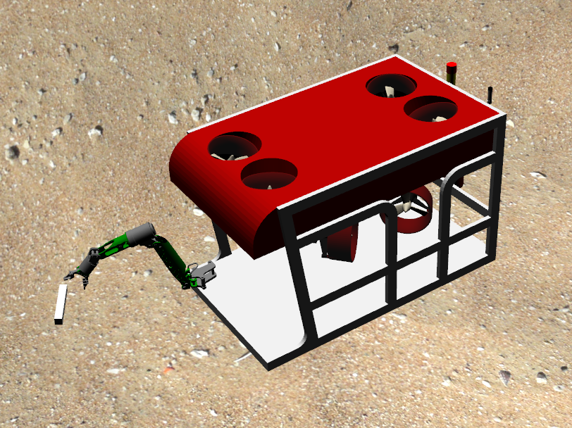

Now that you've set up your development environment and obtained the source code, you can build the project by running:

Here, [catkin_tools](https://catkin-tools.readthedocs.io/en/latest/installing.html) is used to build the project. It compiles in parallel using number of cores in the machine. It supports all the options of `catkin_make` and can be used as a replacement for `catkin_make` in most cases as it is a drop-in replacement for `catkin_make`.

First install, catkin tools to use `catkin build`

- If using Docker, you don't need this part. You already have `catkin build` available.

```bash
# Install build tool catkin_tools
pip3 install -U catkin_tools

# Optionally, you can configure to install the packages
catkin config --install
```

Then build the source code (this may take upto about 10 minutes)

- If using Docker, below commands should be typed inside the docker environment after `./run.bash dockwater:noetic` or `./run.bash -c dockwater:noetic`.

```bash
cd ~/uuv_ws
catkin build
```

When the build is finished, source your new `setup.bash`:
```bash
source ~/uuv_ws/devel/setup.bash
# Source devel/setup.bash or install/setup.bash depending on whether you used the installation option
```
Optionally, you may wish to add `source ~/uuv_ws/devel/setup.bash` to your `.bashrc` file so that you do not have to source the setup file in every new terminal window.

This is experimentally supported until all the CMake dependencies and installations in our packages have been tested.

If fails, use `catkin_make` instead.
```bash
# remove previous build
cd ~/uuv_ws
rm -rf build devel install
catkin_make
```

## Test your Installation
Test that the installation is working by running one of the Dave demos
```bash
roslaunch dave_demo_launch dave_demo.launch
```
If the simulator does not close promptly with Ctrl-C, first try hitting Ctrl-C multiple times. If it still doesn't close you can use the command `pkill gzclient && pkill gzserver` in another terminal window to force immediate shutdown.



More details are discussed at [uuv_simulator_reference](/dave.doc/contents/uuv_simulator_reference).

## Next: [Try out some other tutorials](https://field-robotics-lab.github.io/dave.doc/#tutorials-and-demonstrations)