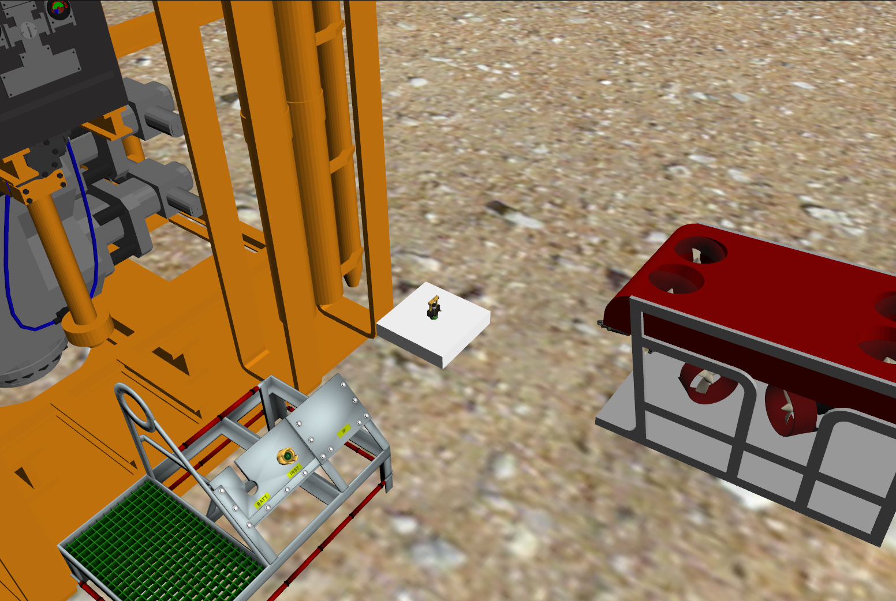
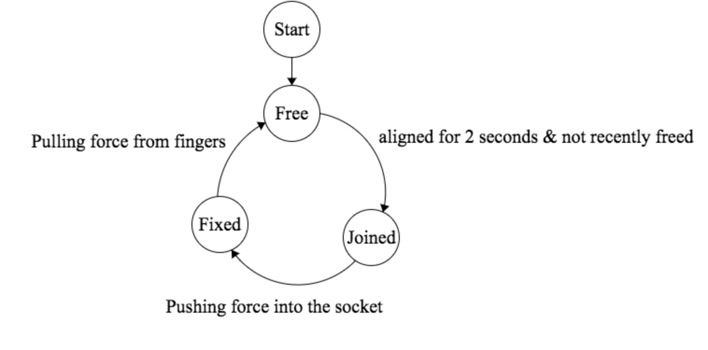
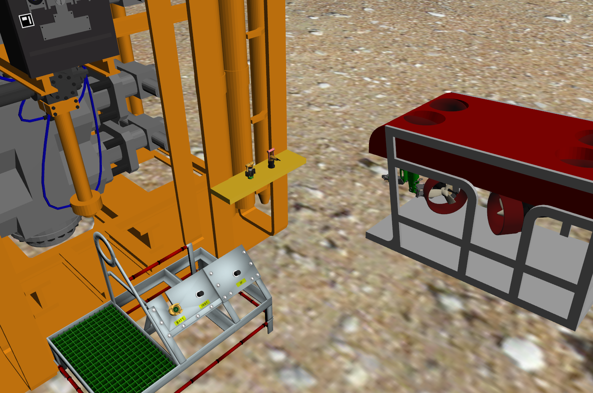
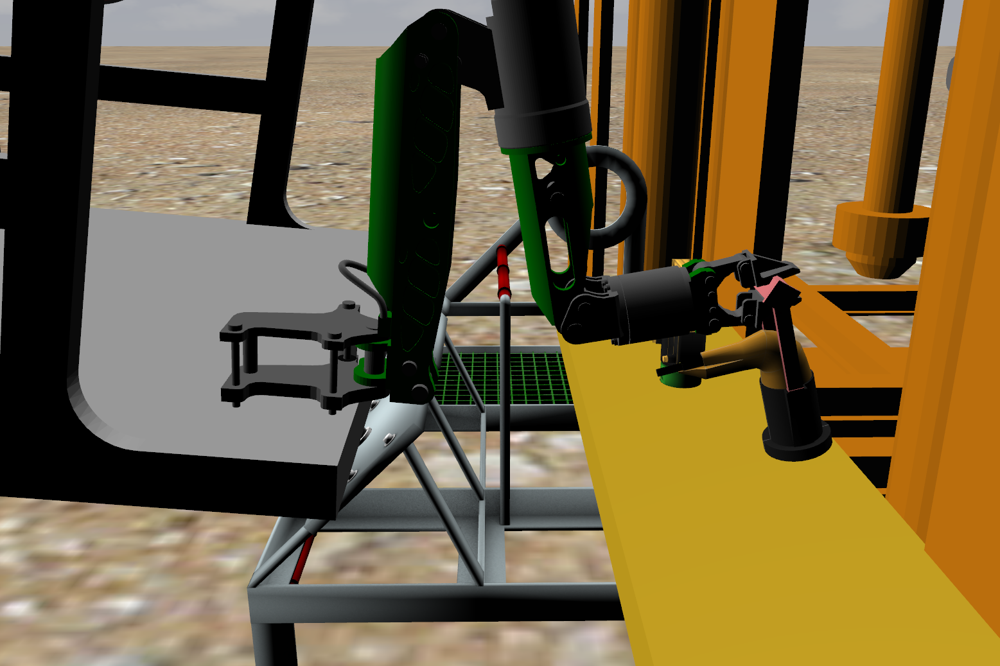
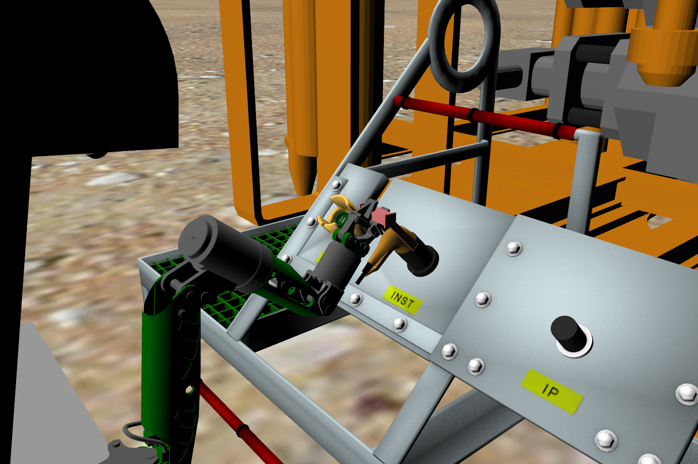

# Overview
Connecting underwater electrical flying leads is a common task that is performed by UUVs in the real world.  A video of this task being performed can be found here:

[](https://www.youtube.com/watch?v=lMfnwZiPp2s)

This plugin provides the latching/unlatching (mating/unmating) functionality to the simulation.

You will need a joystick to perform the actual mission. See [this page](/dave.doc/contents/manipulator_demos/Logitech-F310-Gamepad-Mapping) for controlling the robot and the arm.

# Motivation and Possibilities
Users can program an autonomous mission where the UUV is tasked with grabbing the electrical plug and connecting it to the socket.  The mating and demating are dependent on the forces between the plug and the socket and  their relative alignments to each other.

# Getting Started (dave_demo_launch/dave_electrical_mate.launch)
The `plug_and_socket_plugin` plugin can be found in the `dave_gazebo_model_plugins` package. The `socket_box` model located in the `dave_object_models` package incorporates the plugin and is incorporated into the following demo:

```
roslaunch dave_demo_launch dave_electrical_mate.launch
```

Upon launch, a Gazebo instance is generated with a world containing a RexROV UUV (with manipulator arm), the socket platform (the socket itself is on the front vertical panel), and a plug resting on a static platform.



Closeup views of the plug and socket are provided in the following  images:


The joystick is used to maneuver the UUV and manimpulator arm to grasp the plug, approach the platform, and attach the plug to the socket.  Upon connecting, a joint will be formed automatically to lock the plug to the socket.

A video that demonstrates the functionality of this plugin is provided [here](https://vimeo.com/451301029).

# Plugin Operation
For the plug to mate with the socket, it must be inserted with the correct alignment and pushed with sufficient force.  Similarly, for it to be removed, it must be pulled with sufficient force.  Plugin parameters are specified through the SDF parameters as follows.

```xacro
<plugin name="plug_and_socket" filename="libplugAndSocketPlugin.so">
  <socketTubeLink>socket</socketTubeLink>
  <sensorPlateLink>sensor_plate</sensorPlateLink>
  <plugModel>plug</plugModel>
  <plugLink>plug</plugLink>
  <rollAlignmentTolerance>0.15</rollAlignmentTolerance>
  <pitchAlignmentTolerance>0.15</pitchAlignmentTolerance>
  <yawAlignmentTolerance>0.15</yawAlignmentTolerance>
  <matingForce>25</matingForce>
  <unmatingForce>125</unmatingForce>
</plugin>
```

Default values will be used for any plugin parameter that is not specified in the SDF (values depicted here are the default values but are not necessarily the same values that are used in the demos).

## The State Machine
The plugin itself is abstractly implemented as a finite state machine.  During operation, it transitions between three states as depicted in the following diagram:



### Free State
The state at which the plug can move freely in the world.  In this state, the plug is not physically bound to the socket.  The plug transitions out of this state to the joined state when the plug is aligned with the socket in all three axes and when the plug is within close proximity to the socket.

### Joined State
When the plugin transitions to the joined state, a prismatic joint is dynamically created to bind the plug to the socket. The plug can be pushed towards or pulled away from the the socket when it is in this state, but the joint eliminates all other degrees of freedom to facilitate insertion of the plug (as a door key hole guides the key into the lock). This provides a more robust mechanism for maintaining alignment than relying on the physical geometry of the socket.  Once the plug is inserted all of the way into the socket and the force applied to the socket exceeds the mating force, the plugin transitions into the the fixed state.

### Fixed State
Upon transitioning to the fixed state, the limits of the prismatic joint are set to zero to fix the plug into position.  To release the plug from the socket, a pulling force on the plug must be applied using the UUV's manipulator arm's fingers. When the force exceeds the specified unmating force, the plut-to-socket joint is destroyed and the plugin transitions back to the free state.

A timer is utilized to prevent the plugin from immediately transitioning back to the joined state (after unmating, the plug will be within the alignment and range tolerances).

## ROS Messages
A ROS `geometry_msgs/Vector3Stamped` message is used to publish the force being applied to the plug link during insertion and extraction.  By default, the message is published to a `/<plug link name>/appliedForce` topic (e.g., `\m_to_f_plug\appliedForce` in the demo). The applied force associated with the demo described here can be plotted with the following command:

```bash
rqt_plot /m_to_f_plug/appliedForce/vector
```

Applied force is only published during plug insertion when the plug is in contact with the sensor plate and during extraction when the grasper joints are in contact with the plug.  Force is calculated in the plug link frame as the force applied to the plug link by the sensor plate link (insertion) or grasper links (extraction).  Forces applied along all three axes is provided in the message, but only force applied along the X axis is utilized to determine when to lock (insertion) or unlock (extraction) the temporary joint.  The following image provides an example plot of the applied force during extraction.


## Plugin Parameters
Plugin parameters can be adjusted by including the following SDF plugin elements (default values in parentheses):

* **sensorPlateName**:  string name of the sensor plate link that will apply force to the plug during insertion (default: "sensor_plate")
* **socketTubeLink**:  string name of the receptacle into or onto which the plug is to be inserted (default:  "socket")
* **plugModel**:  string name of the plug model that will be inserted into or onto the receptacle (default: "plug")
* **plugLink**:  string name of the plug model link to which force is to be applied during insertion and extraction (default: "plug")
* **gripperLinkSubstring**:  substring that will be contained in all gripper links that will apply force to the plug during extraction (default:  "finger_tip")
* **rollAlignmentTolerance**:  alignment tolerance (radians) around the receptacle link's X axis for creation of the temporary joint (default: 0.15)
* **pitchAlignmentTolerance**:  alignment tolerance (radians) around the receptacle link's Y axis (i.e., elevation) for creation of the temporary joint (default: 0.15)
* **yawAlignmentTolerance**:  alignment tolerance (radians) around the receptacle link's Z axis (i.e., azimuth) for creation of the temporary joint (default: 0.15)
* **matingForce**:  applied force (Newtons) that must be applied by the sensor plate link to the plug link for the temporary joint to be locked during insertion (default:  50.0)
* **unmatingForce**:  applied force (Newtons) that  must be applied by the gripper links to the plug link for the temporary joint to be unlocked and destroyed during extraction (default:  90.0)
* **linkForceTopic**:  ROS topic name to which applied force messages (`geometry_msgs/Vector3Stamped`) will be published during insertion and extraction (default:  "<plug link name>/appliedForce")

# URDF Models and Demo (dave_demo_launch/dave_plug_and_socket_demo.launch)

URDF (Xacro) versions of the plugin are provided in the `plug_and_socket_description` package to facilitate the utilization of the plugin with arbitrary models.  The URDF macros are incorporated into the following demo:

```
roslaunch dave_demo_launch dave_plug_and_socket_demo.launch
```

Upon launch, a Gazebo instance is generated with a world containing a RexROV UUV (with manipulator arm), a platform with 3 plug receptacles (1 female and 2 male), and two plugs (one male-to-female and one female-to-male) resting on a shelf attached to the platform:



Maneuvering the UUV and manipulator arm is accomplished using the joystick as with the `dave_electrical_mate_demo.launch` example.  The female plug can be joined to either of the male receptacles, and the male plug can be joined to the female receptacle:




# Limitations
1. Since the plug model and link are explicitly specified within the plugin definition, only the plug will be compatible with a particular socket even if multiple plugs will technically "fit".
2. To go from the `Fixed` to `Free` state, the force applied to the plug is computed as the sum of forces applied to the plug link by all links that contain the string "finger_tips" (or an SDF-specified string).  This is required to correctly compute the disconnect force (the socket sensor plate only directly exerts force on the plug when it is pushed), but it means that only one gripper will work correctly with each plugin instance.

# Future Improvements
1. Incremental updates to improve realism and fidelity.
2. Allow for multiple plugs to be used with a single socket when required.

# Relevant links
Initial implementation Pull Request can be found [here](https://github.com/Field-Robotics-Lab/dave/pull/40).
Updated capability Pull Requests can be found [here](https://github.com/Field-Robotics-Lab/dave/pull/161) and [here](https://github.com/Field-Robotics-Lab/dave/pull/189).
