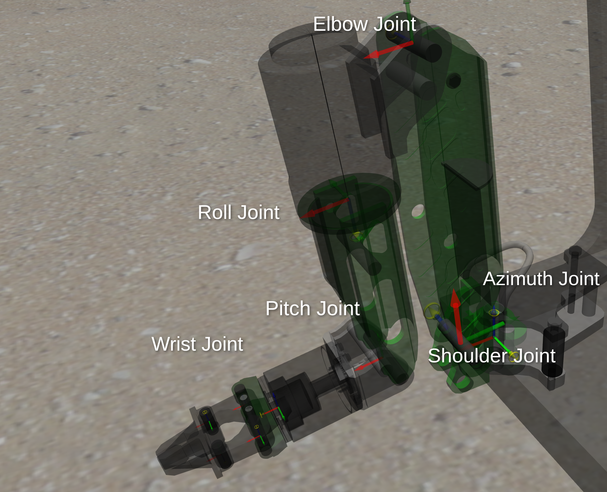
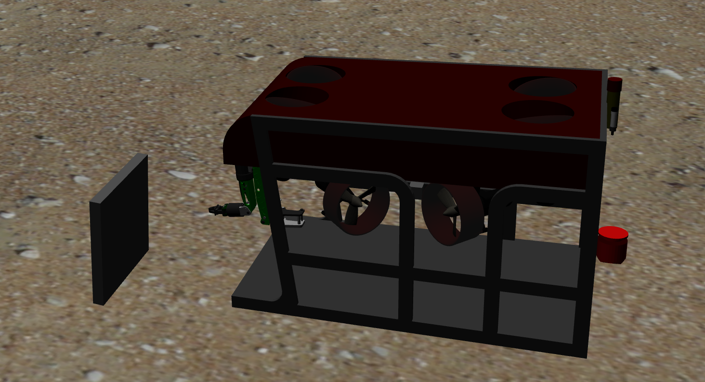

# Overview

Each joint of the manipulator arm has a force-torque (FT) sensor. Each of those sensors provide 6 readings: x,y,z forces and x,y,z torques. The purpose of these sensors is to provide as much feedback as possible to operators when manipulating the arm in a low visibility under-water environment.

## Location of the sensors
For the oberon7 manipulator arm, there are 6 FT sensors located at the following joints:
* azimuth joint
* shoulder joint
* elbow joint
* roll joint
* pitch joint
* wrist joint
* The other joints in the gripper do not have the FT sensor.

To see these joints in Gazebo, you can turn on the transparency and joints from the view menu.
`View > Transparent` and `View > Joints`



## Spring demo
The demo sets up an underwater world with a springy plate that demonstrate the functionality of the FT sensors. To run the demo, launch the following command:
```
roslaunch dave_demo_launch dave_manipulator_spring_demo.launch
```

Once Gazebo launches, you will see the RexROV in front of a springy plate.



## Visualizing the forces and torques using `rqt_plot`

### Using launch file

Run the following launch command to show an rqt plotter showing the current forces on the gripper joint.
```
roslaunch dave_demo_launch dave_manipulator_spring_plot.launch
```

You can see the status of other joints by typing the topic name, followed by the field name, in the `Topic` text box, and clicking the + button.

Here is the format for the topic names for the FT sensors:
```
/rexrov/ft_sensor_<joint_name>
```

If the + button is grayed out, that means the value cannot be plotted. Note that the topic name alone may not be enough, you will have to specify the individual field with a floating point value that can be plotted.

The list of topics available for the FT sensor looks something like this:
```
$ rostopic list | grep ft_sensor
/rexrov/ft_sensor_azimuth
/rexrov/ft_sensor_elbow
/rexrov/ft_sensor_finger_left_joint
/rexrov/ft_sensor_finger_right_joint
/rexrov/ft_sensor_finger_tip_left_joint
/rexrov/ft_sensor_finger_tip_right_joint
/rexrov/ft_sensor_pitch
/rexrov/ft_sensor_roll
/rexrov/ft_sensor_shoulder
/rexrov/ft_sensor_wrist
```

You can echo them to see the available fields. For example, the FT sensor at the elbow joint has these fields:
```
$ rostopic echo /rexrov/ft_sensor_elbow
header:
  seq: 0
  stamp:
    secs: 502
    nsecs: 132000000
  frame_id: "oberon7/elbow_link"
wrench:
  force:
    x: 17.4937491655261
    y: -227.91032518987646
    z: 7.199161641145366
  torque:
    x: -3.034154831890273
    y: -1.6899335009832015
    z: -195.65852993938353
```

So if you want to see the x force on the wrist joint, the topic is
```
/rexrov/ft_sensor_wrist/wrench/force/x
```

You can watch [this video](https://vimeo.com/422486993) that demonstrates the feedback functionality in this spring world.

### Using `rqt_plot` directly

As an alternative to the launch file, you can run `rqt_plot` directly, passing in topic names as command line arguments:
```
rosrun rqt_plot rqt_plot /rexrov/ftensor_wrist/wrench/torque/x /rexrov/ft_sensor_wrist/wrench/torque/y /rexrov/ft_sensor_wrist/wrench/torque/z
```

See this [video example for torque sensing](https://vimeo.com/422977387).
