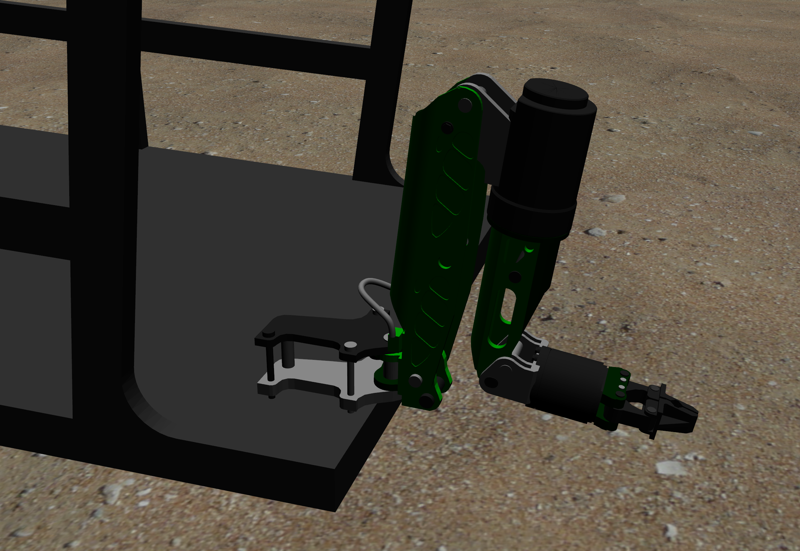
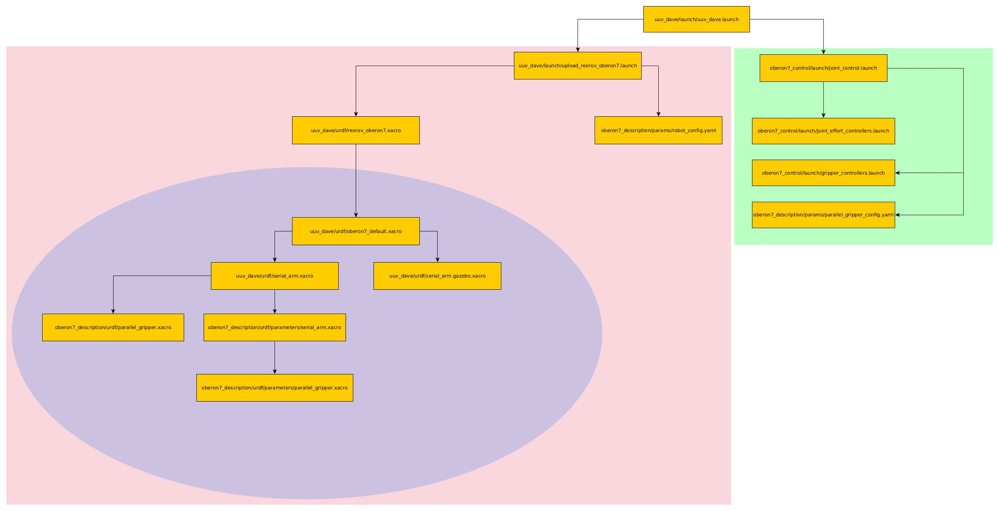

# Quick Start

The default arm loaded in `dave_demo.launch` is the Oberon7 arm. This tutorial details how to swap out that arm and put a different arm (the Predator arm is shown in this tutorial) on the RexROV robot base.

To see the final result, that is, the predator arm swapped for the oberon7 arm, you can run this command:
```
roslaunch dave_robot_launch rexrov_predator.launch
```

You should see the following arm:


The folks from UUV Simulator made two manipulators, the Oberon7 and the Oberon4 manipulators. The Oberon7 is inspired by the Schilling Robotics Orion 7P.

Before you start this tutorial, it is best that you have a xacro file with the joints and links of the manipulator you want to integrate with the UUV.

# Understanding the call hierarchy

To see the original arm before the swap, run the following command, which launches several other launch files and loads many xacros.

```
roslaunch dave_demo_launch dave_demo.launch
```



The figure below shows the different launch and xacro files that pertains to the manipulator functionality.




Following is a list of what each of those files do:
* **dave_demo.launch**: The main launch file that is called in the terminal.
  * Launches the ocean world
  * Launches the `upload_rexrov_predator.launch`
  * Launches `joy_accel.launch` which is launches a node that enables controlling the acceleration of the UUV.
  * Launches the `joint_control.launch`  which launches a node that enables controlling the manipulator using the joystick.
* **upload_rexrov_oberon7.launch**:
  * Loads the xacro chain that defines the robot by calling the root xacro (rexrov_oberon7.xacro).
  * Spawns the robot defined by the xacro
  * Loads the params in `robot_config.yaml` into rosparam.
* **rexrov_oberon7.xacro**: Root of the xacro chain that defines the rexrov and the oberon7.
* **robot_config.yaml**: A file that contains parameters that are loaded into rosparam. These params include the names of the joints and the initial angles of these joints.
* **obeorn7_default.xacro**: Root of the xacro chain that defines the oberon7. It includes both the gazebo (TODO)
* **serial_arm.xacro**: Defines the macro `oberon7_serial_arm` that defines the links and joints of the oberon7 arm.
* **serial_arm.gazebo.xacro**: Contains the gazebo elements of the links and joints defined in the serial_arm.xacro.
* **parameters/serial_arm.xacro**: Contains link parameters that are used in the `serial_arm.xacro` file.
* **parallel_gripper.xacro**: Contains the gripper links and joints.
* **parameters/parallel_gripper**: Contains link parameters that are used in the `parallel_gripper.xacro` file.
* **joint_control.launch**:
  * Launches the `joint_position_controller.py` node that subscribes to the joy commands and send control commands to the arm after passing them through a PID.
  * Launches `joint_effort_controllers.launch`
  * Launches `gripper_controllers.launch`
* **joint_effort_controllers.launch**:
  * Launches the control manager node for the serial arm.
  * Defines and loads joint effort controller's PID values into rosparam.
* **gripper_controllers.launch**
  * Launches `gripper_controller.py` which is analogous to the `joint_position_controller.py` previously mentioned but for the grippers.
* **parallel_gripper_config.yaml**

# The process

To swap out the oberon7 arm with something else, some of these files need to be edited or changed as follows (for these examples I will be using swapping the oberon7 arm with a predator arm as an example):

> Note: By convention, your xacro file that defines the manipulator should be placed in a ROS package called `<arm_name>_description`. Also, please note that, in the case of the oberon7 arm, the oberon7 root xacro file is the `oberon7_default.xacro`. There is a hierarchy of xacro files to increase modularity and improve clarity, but you can chose to not rely on macros and have less xacro files. Essentially the entire xacro chain (in the blue colour) can be reduced to only one xacro file.

## Loading the uuv with your own manipulator arm

* Make a copy of the `uuv_dave/urdf/rexrov_oberon7.xacro` file and call it `rexrov_<arm_name>.xacro`. In that file you will see the following lines.
```
<xacro:include filename="$(find uuv_dave)/urdf/oberon7_default.xacro" />
```

and line
```
  <xacro:oberon7 namespace="oberon7" parent="$(arg namespace)/base_link">
    <origin xyz="1.3 -0.5 -0.615" rpy="0 0 0"/>
  </xacro:oberon7>
```

The first one includes the xacro file that file that defines the macro of the manipulator. The second set of lines call that macro. So in your case you should edit these lines to include the xacro file that defines a macro for your own robot, then call on your own macro.

In case of the predator arm, it looks something like this.
```
<xacro:include filename="$(find uuv_dave)/urdf/predator_default.xacro" />
```

and
```
  <xacro:predator namespace="predator" parent="$(arg namespace)/base_link">
    <origin xyz="1.3 -0.5 -0.615" rpy="0 0 0"/>
  </xacro:predator>
```

Make sure that the joints in your xacro have transmissions so the controller is able to control them. Additionally, if you want to have force-torque sensors at the joints, make sure to have the `ft_sensor` plugin.
You can chose to have the same hierarchy as the one that already exists, but it's not necessary.

## Configuring the joint controller

Your arm is likely to have different joint names than the oberon7 arm. Yours may not even be a 7 DOF arm. So you will likely need to configure the joy launch files (the ones shaded green in the diagram above).
* In the `joint_control.launch` file, make sure the edit the section under the `joint_position_controller.py` node initiation to accurately reflect the joint names of your manipulator arm.
* For the `joint_effort_controllers.launch`, make sure to also edit the joint names to accuracy represent the joint names in your own robot.
* There are a couple of yaml files that you need to edit too, such as `robot_config.yaml`.

Please note that these files should be located in a new package named `<arm_name>_control` (by convention). In this case, I made a new package called `predator_control` and copied and pasted things from oberon7 control into that new package.

## Making the main launch file

After you have edited both components, the joystick joint control and the xacro files defining the arm. It's time to bring it all together. Duplicate the `dave_demo.launch` file and edit it to include your launch files that refer to your xacro files and the joy `joint_control.launch` that pertains to your manipulator arm.

