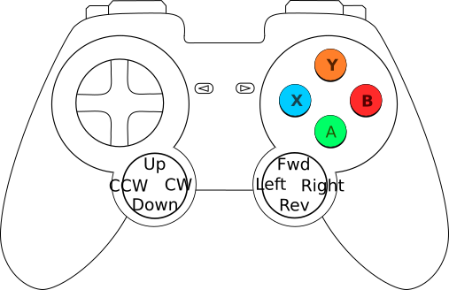
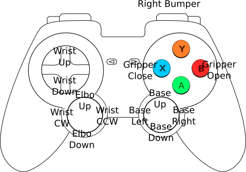

This page describes usage for the reference configuration of Project DAVE.  The reference configuration includes:

* An underwater environment, including an ocean floor.
* A UUV including thrusters, a manipulator arm, and sensors.
* A bar on the ocean floor that the UUV can grab.

Here is an example view:


# Run the UUV simulation

```bash
roslaunch uuv_dave uuv_dave.launch
```
# Control the UUV
The simulation may be controlled using a joystick.  Joystick operation depends on joystick mode:

Mode | Control
--- | ---
Default | UUV Body
Right Bumper pressed | Oberon 7 Arm

UUV body controls:



Oberon 7 Arm controls:



# Control the Gazebo camera
Control Gazebo's camera scene view using the mouse, see http://gazebosim.org/hotkeys.html.